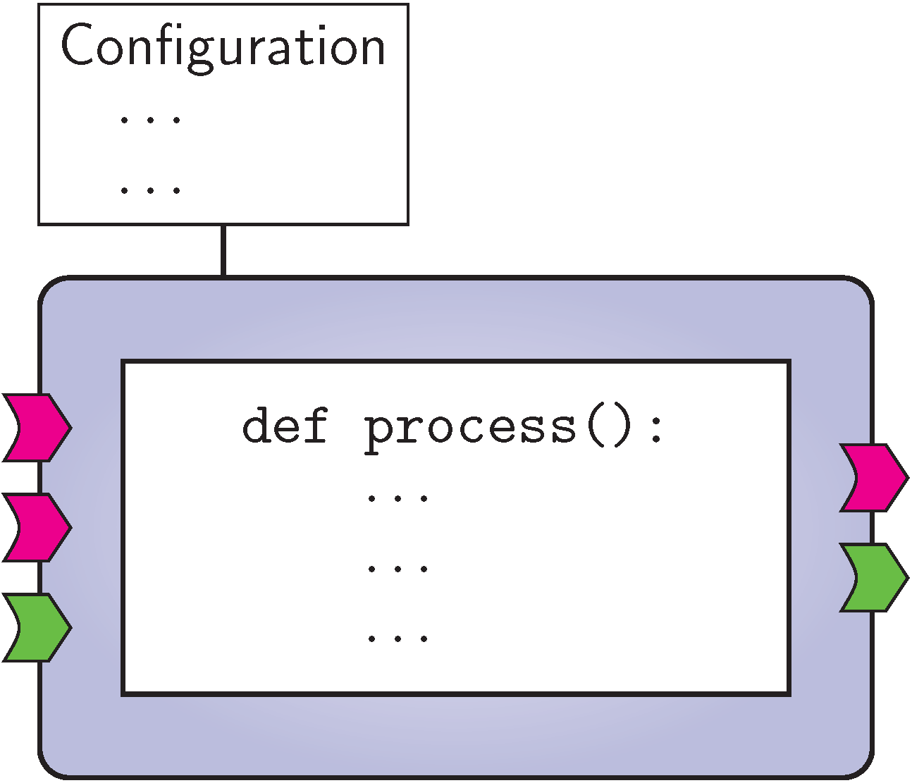
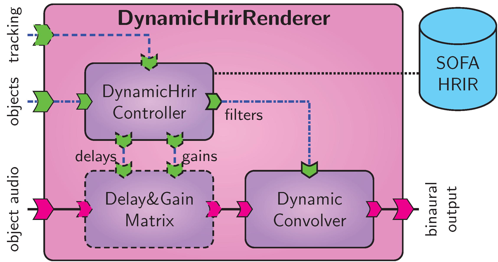
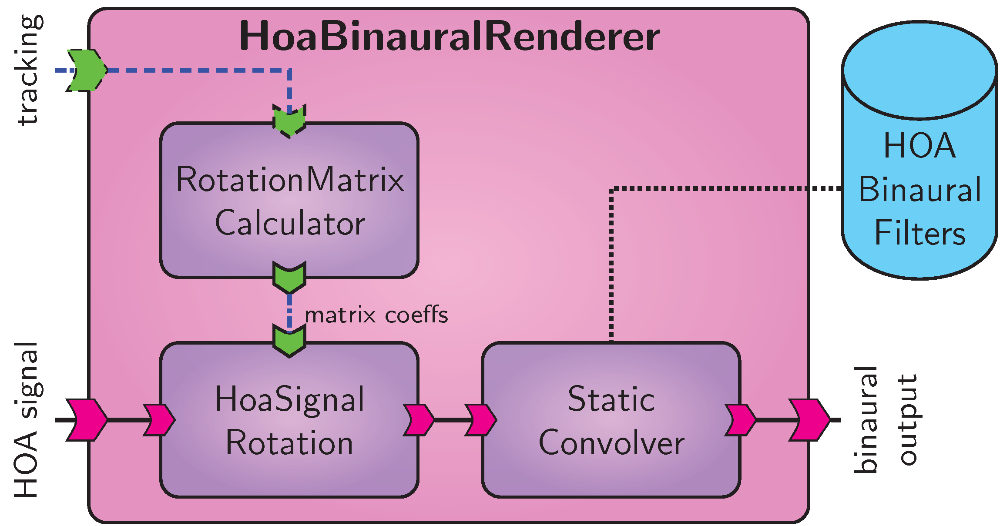
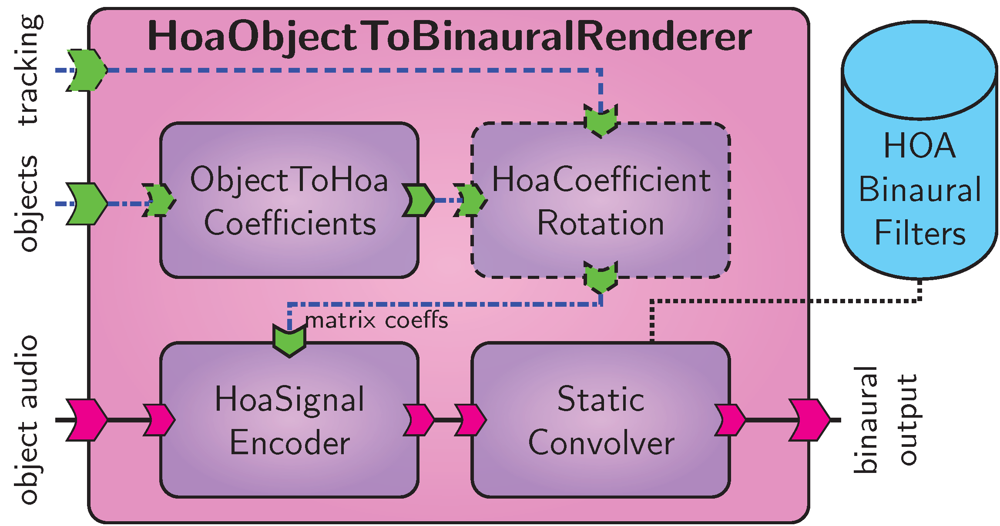
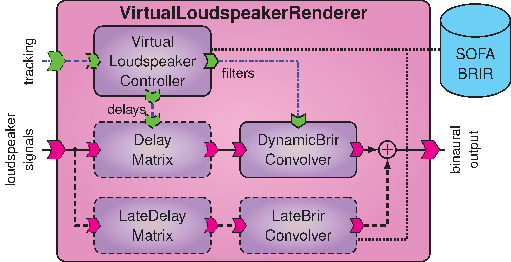
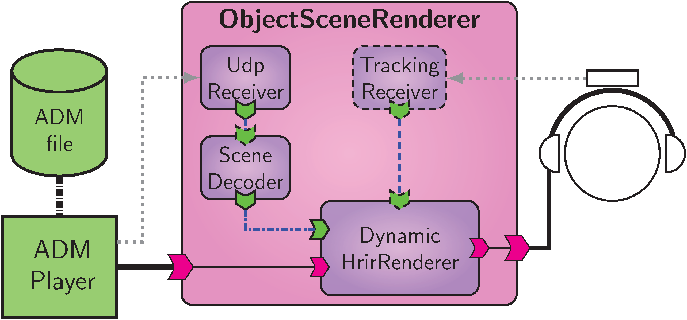
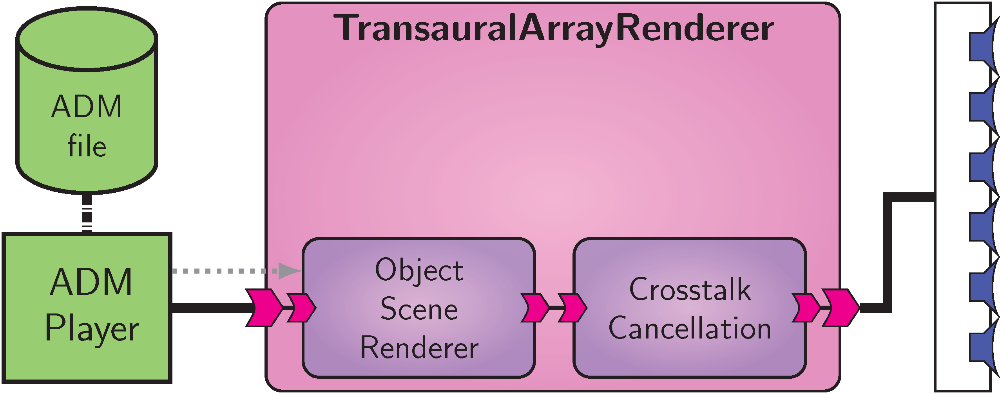

.. Copyright Andreas Franck 2018 - All rights reserved.
.. Copyright University of Southampton 2018 - All rights reserved.
   
.. _visr_bst:
   
The Binaural Synthesis Toolkit
------------------------------

.. toctree::

The binaural synthesis toolkit (VISR_BST) is an extensible set of components for realtime and offline binaural synthesis.

This section consists of two parts.
First, :ref:`visr_bst_tutorial` introduces the BST in a tutorial-style form.
After that, the  :ref:`visr_bst_component_reference` describes all components and helper classes and functions in detail. 

.. _visr_bst_tutorial:
   
Tutorial
^^^^^^^^

.. note:: This tutorial is based on the AES e-Brief:

   Franck, A., Costantini, G., Pike, C., and Fazi, F. M., “An Open Realtime Binaural Synthesis Toolkit for Audio Research,” in Proc. Audio Eng. Soc. 144th Conv., Milano, Italy, 2018, Engineering Brief."

Binaural synthesis has gained fundamental importance both as a practical sound reproduction method and as a tool in audio research. Binaural rendering requires significant implementation effort, especially if head movement tracking or dynamic sound scenes are required, thus impeding audio research. For this reason we propose the Binaural Synthesis Toolkit (BST), a portable, open source, and extensible software package for binaural synthesis. In this paper we present the design of the BST and the three rendering approaches currently implemented. In contrast to most other software, the BST can easily be adapted and extended by users. The Binaural Synthesis Toolkit is released as an open software package as a flexible solution for binaural reproduction and to foster reproducible research in this field.

.. _visr_bst_sec_tutorial_introduction:

Introduction
~~~~~~~~~~~~

Binaural synthesis aims at recreating spatial audio by recreating binaural signals at the listener's ears :cite:`bst-nicol2010_binaural_technology`, using either headphones or loudspeakers.
While binaural technology is an area of active research for a long time, the shift of music consumption towards mobile listening, object-based content, as well as the increasing importance of augmented and virtual reality (AR/VR) applications emphasize the increasing significance of binaural reproduction.
In addition, binaural techniques are an important tool in many areas of audio research and development, from basic perceptual experiments to auralization of acoustic environments or the evaluation of spatial sound reproduction :cite:`bst-lindau_weinzierl2012_assessing_the_plausibility_of_virtual_acoustic_environments`.

Regardless of the application, synthesizing binaural content invariably comprises a number of software building blocks, e.g., HRTF/BRIR selection and/or interpolation, signal filtering, modeling and applying interaural time and level differences, etc. :cite:`bst-jot_larcher_warusfel_1995_digital_signal_processing_issues_in_the_context_of_binaural_and_transaural_stereophony`.
Dynamic binaural synthesis significantly increases the plausibility of reproduction by including dynamic cues as head movements :cite:`bst-algazi_duda2011_headphone-based_spatial_sound`, but requires both a real-time implementation and additional DSP functionality as time-variant delays, dynamic filter updates, and filter crossfading techniques.
This implies a considerable implementation effort for research based on binaural synthesis, increases the likelihood of errors due to implementation effects, and makes it difficult to reproduce or evaluate the research of others.
This argument is in line with the increasing importance of software in (audio) research, e.g., :cite:`bst-cannam_figueira_plumbley2012_sound_software_towards_software_research_in_audio_and_music_research`, and the generally growing awareness of reproducible research, e.g., :cite:`bst-wilson_et_al2014_best_practices_for_scientific_computing`.

For this reason we introduce the Binaural Synthesis Toolkit (BST) as an open source, portable, and extensible software library for real-time and offline binaural synthesis.
Our intention is to provide baseline implementations for main binaural rendering schemes as well as DSP building blocks that enable the modification of existing renderers as well as the implementation of new rendering approaches.

The objective of its paper is to describe the architecture of the BST to enable its use as well as its adaptation by the audio community.
In essence, the BST is a set of processing components implemented within the VISR --- an open  software rendering framework for audio rendering :cite:`bst-franck_et_al2018_an_open_software_rendering_framework_for_audio_reproduction_and_reproducible_research` --- and preconfigured renderers built upon these components.
At the moment, three renderers are provided, namely HRIR-based dynamic synthesis, e.g., :cite:`bst-algazi_duda2011_headphone-based_spatial_sound`, virtual loudspeaker synthesis (also termed room scanning :cite:`bst-mackensen_et_al1999_binaural_room_scanning_a_new_tool_for_acoustic_and_psychoacoustic_research`), and binaural rendering based on higher order Ambisonics (HOA), e.g., :cite:`bst-daniel_rault_polack1998_ambisonics_encoding_of_other_audio_format_for_multiple_listening_conditions`.
BRIR/HRIR data can be provided in the AES69-2015 format (SOFA) :cite:`bst-aes2015_aes69_sofa_standard` (http://www.sofaconventions.org), allowing for arbitrary HRIR/BRIR measurement grids, and enabling the use of a wide range of impulse response datasets.

Compared to existing software projects supporting binaural synthesis, for instance Spat :cite:`bst-daniel_rault_polack1998_ambisonics_encoding_of_other_audio_format_for_multiple_listening_conditions` or the SoundScape Renderer (SSR) :cite:`bst-geier_spors2012_spatial_audio_with_the_soundscape_renderer`, the BST offers several new possibilities.
On the one hand, its modular structure is designed for easy adaptation and extension rather than providing a fixed functionality.
To a large extent, this is achieved by the Python language interface of the underlying VISR, and the fact that most high-level BST components are implemented in Python.
On the other hand, while most other software projects are mainly for real-time use, BST components can be used both in real-time and in fully parametrizable offline simulations using the same code base.
This makes the BST an effective tool for algorithm development. 
Again, these capabilities are enabled mainly by the Python language integration of the BST and the underlying VISR.

This paper is structured as follows.
The underlying VISR framework and how its features influence the design and the uses of the BST is briefly outlined in Sec. :ref:`visr_bst_sec_tutorial_introduction`.
Section :ref:`visr_bst_sec_tutorial_preconfigured_renderers` discusses the three rendering approaches currently implemented in the BST, their use, configuration, and optional features.
The main building blocks of these renderers, which can also be used to adapt the BST or to implement different synthesis methods, are outlined in section Sec. :ref:`visr_bst_sec_tutorial_rendering_building_blocks`.
Section :ref:`visr_bst_sec_tutorial_application_examples` shows practical examples of using the BST, while
Sec. :ref:`visr_bst_sec_tutorial_conclusion` summarizes the paper.

.. _visr_bst_sec_tutorial_visr_framework:

The VISR Framework
~~~~~~~~~~~~~~~~~~

The binaural synthesis toolkit is based on the VISR (Versatile Interactive Scene Renderer) framework, an open-source, portable, and extensible software for audio processing :cite:`bst-franck_et_al2018_an_open_software_rendering_framework_for_audio_reproduction_and_reproducible_research`.
It is being developed as part of the S3A project (http://www.s3a-spatialaudio.org) :cite:`bst-coleman_et_al2018_an_audio-visual_system_for_object_based_audio`.
At the moment, it is supported on Linux (Intel and Raspberry Pi), Mac OS X, and Windows.
VISR is a general-purpose audio processing software with emphasis on, but not limited to, multichannel and object-based audio.
This section outlines the main features of the VISR framework and the implications on design and usage of the BST.

Component-Based Design
''''''''''''''''''''''

.. _figure_visr_bst_component_schematic:

.. figure:: ../images/visr_bst/visr_component_schematic.png
   :width: 80%
   :align: center   
   
   General interface of a VISR component.

VISR is a software framework, which means that it enables a systematic reuse of functionalities and is designed for extension by users.
To this, all processing tasks are implemented within *components*, software entities that communicate with other components and the external environment through a defined, common interface.
Fig. :ref:`figure_visr_bst_component_schematic` depicts the general structure of a component.

Ports
'''''

Data inputs and outputs to components are represented by *ports*.
They enable configurable, directional flow of information between components or with the outside environment. 
There are two distinct types of ports: audio and parameter ports.
Audio ports accept or create multichannel audio signals with an arbitrary, configurable number of single/mono audio signal waveforms, which is referred as the *width* of the port.
Audio ports are configured with unique name, a width and a sample type such as :code:`float` or :code:`int16`.

Parameter ports, on the other hand, convey control and parameter information between components or from and to the external environment.
Parameter data is significantly more diverse than audio data.
For example, parameter data used in the BST includes vectors of gain or delay values, FIR or IIR filter coefficients, audio object metadata, and structures to represent the listener's orientation.
In addition to the data type, there are also different communication semantics for parameters.
For example, data can change in each iteration of the audio processing, be updated only sporadically, or communicated through messages queues.
In VISR, these semantics are termed *communication protocols* and form an additional property of a parameter port.
The semantics described above are implemented by the communication protocols :code:`SharedData`, :code:`DoubleBuffering`, and :code:`MessageQueue`, respectively.
Several parameter types feature additional configuration data, such as the dimension of a matrix parameter.
In the VISR framework, such options are passed in :code:`ParameterConfig` objects.
This allows extensive type checking, for instance to ensure that only matrix parameter of matching dimensions are connected.
Combining these features, a parameter port is described by these properties: a unique name, a parameter type, a communication protocol type and an optional parameter configuration object.

Hierarchical Signal Flows
'''''''''''''''''''''''''

To create and reuse more complex functionality out of existing building blocks, VISR signal flows can be structured hierarchically.
To this end, there are two different kinds of components in VISR, *atomic* and *composite*.
They have the same external interface, that means that they can be used in the same way.
Figures :ref:`figure_visr_bst_atomic_component` and :ref:`figure_visr_bst_composite_component` schematically depict these two types.

.. _figure_visr_bst_atomic_component:

   
   Atomic VISR component.

*Atomic components* implement processing task in program code, e.g., in C++ or Python.
They feature a constructor which may take a variety of configuration options to tailor the behaviour of the component and to initialize its state.
The operation of an atomic component is implemented in the :code:`process` method.

.. _figure_visr_bst_composite_component:

.. figure:: ../images/visr_bst/visr_composite_component.png
   :width: 80%
   :align: center   
   
   Composite VISR component.

In contrast, a *composite component* contains a set of interconnected components (atomic or composite) to define its behaviour.
This allows the specification of more complex signal flows in terms of existing functionality, but also the reuse of such complex signal flows.
As their atomic counterparts, they may take a rich set of constructor options.
These can control which contained components are constructed, how they are configured, and how they are connected.
It is worth noting that nested components do not impair computational efficiency because the hierarchy is flattened at initialisation time and therefore not visible to the runtime engine.

This hierarchical structure has far-reaching consequences for the design and the use of the BST.
Firstly, it allows for an easy use of existing VISR components in BST components.
Secondly, BST renderers can easily be augmented by additional functionality, such as receiving and decoding of object metadata or headtracking information, by wrapping it into a new composite component.
Thirdly, BST functionality can be conveniently integrated into larger audio applications implemented in the VISR, for instance the transaural loudspeaker array rendering described in Sec. :ref:`visr_bst_subsec_tutorial_application_examples_transaural_loudspeaker_array`.

Standard Component Library
''''''''''''''''''''''''''

The runtime component library (:code:`rcl`) of the VISR framework contains a number of components for general-purpose DSP and object-based audio operations.
They are typically implemented in C++ and therefore relatively efficient.
The rcl library includes arithmetic operations on multichannel signals, gain vectors and matrices, delay lines, FIR and IIR filtering blocks, but also network senders and receivers and
components for decoding and handling of object audio metadata.

Runtime Engine
''''''''''''''

A key objective of the VISR framework is to enable users to focus on their processing task – performed in
a component – while automating tedious tasks, such as error checking, communication between components,
or interfacing audio hardware, as far as possible.
The rendering runtime library (rrl) serves this purpose. Starting from a top-level component,
it is only necessary to construct an object of type :code:`AudioSignalFlow` for this component. All operations
from consistency checking to the initialization of memory buffers and data structures for rendering is
performed by this object. The audiointerfaces library provides abstractions for different audio interface
APIs (such as Jack, PortAudio, or ASIO). Realtime rendering is started by connecting the SignalFlow
object to an audiointerfaces object.

Python interface
''''''''''''''''
While the core of the VISR framework is implemented in C++, it provides a full application programming interface (API) for the Python programming language.
This is to enable users to adapt or extend signal flows more productively, using an interpreted language with a more accessible, readable syntax and enabling the use of rich libraries for numeric computing and DSP, such as NumPy and SciPy :cite:`bst-oliphant2007_python_for_scientific_computing`.
The Python API can be used in three principal ways:

**Configuring and running signal flows**
  Components can be created and configured from the interactive Python interpreters or script files.
  This makes this task fully programmable and removes the need for external scripts to configure renders.
  In the same way, audio interfaces can be configured, instantiated and started from within Python, enabling
  realtime rendering from within an interactive interpreter.
**Extending and creating signal flow**
  As described above, complex signal flows are typically created as composite components.
  This can be done in Python by deriving a class from the base class :code:`visr.CompositeComponent`.
  The behavior of the signal flow is defined in the class' constructor by creating external ports, contained components,
  and their interconnections.
  Instances of this class can be used for realtime rendering from the Python interpreter, as described above,
  or from a standalone application.
  Most of the BST renderer signal flows are implemented in this way, ensuring readability and easy extension by users.
**Adding atomic functionality**
  In the same way as composites, atomic components can be implemented by deriving from :code:`visr.AtomicComponent`.
  This involves implementing the constructor set up the component and the :code:`process()` method that performs
  the run-time processing.
  The resulting objects can be embedded in either Python or C++ composite components (via a helper class :code:`PythonWrapper`).
  In the BST toolkit, the controller components that define the logic of the specific binaural rendering approaches are implemented as atomic components in Python.
  This language choice allows for rapid prototyping, comprehensible code, and easy adaptation.
  
Offline Rendering
'''''''''''''''''

By virtue of the Python integration, signal flows implemented as components are not limited to realtime rendering, but can also be executed in an offline programming environment.
Because the top-level audio and parameter ports of a component can be accessed externally, dynamic rendering features such as moving objects or head movements can be simulated in a deterministic way.
In the majority of uses, this is most conveniently performed in an interactive Python environment.
Applications of this feature range from regression tests of atomic components or complex composite signal flows, performance simulations, to offline rendering of complete sound scenes.
A full characterization of the offline rendering support is beyond the scope of this paper, interested readers are referred to :cite:`bst-franck_et_al2018_an_open_software_rendering_framework_for_audio_reproduction_and_reproducible_research`.

Use in multiple software environments
'''''''''''''''''''''''''''''''''''''
In addition to realtime rendering and offline Python scripting, VISR components can also be embedded into audio software environments such as digital audio  workstations (DAWs) plugins, or Max/MSP or Pd externals.
This means that parts of the BST can be used from these applications, creating new tools and integrating into the workflow of more researchers and creatives.
Support libraries are provided to ease this task by reducing the amount of code required for this embedding.
Again, a full discussion of this paper is beyond the scope of this paper, see :cite:`bst-franck_et_al2018_an_open_software_rendering_framework_for_audio_reproduction_and_reproducible_research` for a discussion.

.. _visr_bst_sec_tutorial_preconfigured_renderers:

Preconfigured Binaural Renderers
~~~~~~~~~~~~~~~~~~~~~~~~~~~~~~~~

The VISR Binaural Synthesis Toolkit contains prepackaged, configurable renderers (or signal flows) for three major binaural synthesis strategies. They are implemented as composite VISR components in Python. On the one hand, this means that they can be readily used either as standalone binaural renderers or as part of larger audio processing schemes. On the other hand, the use of Python allows for easy modification and extension. This section describes the general structure and the configuration options of these three renderers.
Features common to all approaches, such as an option to include headphone transfer function (HPTF) compensation filters, are not described here.
Entities such as components, ports, or configuration options are set in a monospaced font, e.g., :code:`input`.

.. _visr_bst_subsec_tutorial_dynamic_hrir_based_synthesis:

Dynamic HRIR-Based Synthesis
''''''''''''''''''''''''''''

This approach renders sound objects, typically point sources or plane waves represented by position metadata and a mono signal, using spatial datasets of head-related impulse responses (HRIR) or, equivalently, head-related transfer functions (HRTFs), e.g., :cite:`bst-jot_larcher_warusfel_1995_digital_signal_processing_issues_in_the_context_of_binaural_and_transaural_stereophony,bst-algazi_duda2011_headphone-based_spatial_sound`.
This approach is widely used in audio research and for practical reproduction and is well-suited for object-based audio as well as AR/VR applications.
In its basic form, it synthesizes sound scenes under freefield conditions, and is therefore often augmented by a reverberation engine, e.g., :cite:`bst-jot_walsh_philp2006_binaural_simulation_of_complex_acoustic_scenes_for_interactive_audio`.

.. _figure_visr_bst_dynamic_hrir_synthesis:

   
   Dynamic binaural synthesis rendering component. Optional parts are dashed.

The signal flow of the BST dynamic HRIR renderer is shown in :ref:`figure_visr_bst_dynamic_hrir_synthesis`.
It is implemented as a composite VISR component named :code:`DynamicHrirRenderer`.
The logic of the synthesis is encapsulated in the atomic component :code:`DynamicHrirController`.
It receives object metadata and determines a pair of HRIR filters for each object, which are transmitted to the DSP components.
The controller is initialized with a spatial HRIR dataset and the corresponding grid locations of the IRs.
Audio object metadata, including positions and levels, are received through the parameter input port :code:`objects`.
If present, the listener's head orientation is received through the optional input :code:`tracking` and incorporated in the HRIR calculation.
At the moment, two HRIR calculation methods are supported: nearest-neighbour selection and barycentric interpolation using a Delaunay triangulation, e.g., :cite:`bst-gamper2013_selection_and_interpolation_of_hrtf_for_rendering_moving_virtual_sources`.
The generated IRs, one per sound object and ear, are transmitted through the output port :code:`filters` to the :code:`DynamicConvolver` component, which performs time-variant MIMO (multiple-input, multiple-output) FFT-based convolution of the object audio signals and combines them into binaural output. 
Depending on the configuration, the :code:`DynamicConvolver` uses crossfading to reduce audible artifacts when changing filters.

The HRTF dataset, including the measurement position grid, can be provided in the AES69:2015 (SOFA) format :cite:`bst-aes2015_aes69_sofa_standard`.
Optionally the rendering component accepts preprocessed datasets where the HRIRs are time-aligned and the onset delays are kept apart (e.g., in the :code:`Data.Delay` field of the SOFA format).
Applying the delays separately can improve HRIR interpolation quality, reduces audible effects when updating filters, and can therefore enable the use of coarser HRIR datasets, e.g., :cite:`bst-jot_larcher_warusfel_1995_digital_signal_processing_issues_in_the_context_of_binaural_and_transaural_stereophony`.
Because the pure delay part of the HRIRs dominates the ITD cue of the synthesized binaural signal, this also provides a means to use alternative ITD models instead of the measured IR delays, or to implement ITD  individualization :cite:`bst-lindau_estrella_weinzierl2010_individualization_of_dynamic_binaural_synthesis_by_real_time_manipulation_of_the_itd`.
In the same way, the filter gain may be calculated separately, for instance to simulate near-field source effects :cite:`bst-jot_walsh_philp2006_binaural_simulation_of_complex_acoustic_scenes_for_interactive_audio`.
In either of these cases, the dynamic delay and/or gain coefficients are calculated in the :code:`DynamicHrirController`, and the optional component :code:`DelayGainMatrix` is instantiated to apply these values prior to the convolution.
As described in Sec. :ref:`visr_bst_sec_tutorial_building_blocks_delays`, the delay/gain components support configurable fractional delay filtering and smooth parameter updates, thus ensuring audio quality and reducing audible artifacts in dynamic rendering scenarios.

.. _visr_bst_tutorial_hoa_based_synthesis:

Higher Order Ambisonics-Based Synthesis
'''''''''''''''''''''''''''''''''''''''

A second approach, termed HOA (Higher Order Ambisonics)-based synthesis, is based on a spherical harmonics (SH) representation of a spatial sound scene, i.e., higher-order B-format.
First-order B-format binaural synthesis has been proposed, e.g., in :cite:`bst-mckeag_mcgrath1996_sound_field_format_to_binaural_decoder_with_head_tracking,bst-jot_wardle_larcher1998_approaches_to_binaural_synthesis`, and extended to higher Ambisonic orders, e.g., :cite:`bst-bernschuetz_et_al2014_binaural_reproduction_of_plane_waves_with_reduced_modal_order`.
This scene-based rendering approach forms, for example, the basis of the spatial audio synthesis in Facebook's Audio360 Google's Resonance Audio SDK https://github.com/resonance-audio/resonance-audio-web-sdk.

.. _figure_visr_bst_hoa_to_binaural_renderer:

   
   Binaural synthesis based on HOA.

The signal flow of the generic HOA synthesis renderer is depicted in Fig. :ref:`figure_visr_bst_hoa_to_binaural_renderer`.
The component :code:`HoaBinauralRenderer` accepts a HOA input signal, i.e., higher-order B-format, of a selectable order :math:`L`, consisting of :math:`(L+1)^2` channels.
If head tracking is enabled, the component :code:`RotationMatrixCalculator` computes a rotation matrix for spherical harmonics using a recurrent formula :cite:`bst-ivanic_ruedenberg1996_rotation_matrices_for_real_spherical_harmonics_direct_determination_by_recursion`.
These coefficients are applied to the B-format signal in the gain matrix component :code:`HoaSignalRotation`, effectively rotating the sound field to compensate for the listener's orientation.
The component of this signal are filtered with a bank of :math:`(L+1)^2` static FIR filters for each ear :cite:`bst-bernschuetz_et_al2014_binaural_reproduction_of_plane_waves_with_reduced_modal_order` in the :code:`StaticConvolver` component, which also performs an ear-wise summation of the filtered signals to yield the binaural output signal.

.. _figure_visr_bst_hoa_object_to_binaural_renderer:

   
   HOA binaural synthesis of object-based scenes.

Figure :ref:`figure_visr_bst_hoa_object_to_binaural_renderer` shows a variant of the HOA synthesis that operates on an object-based scene.
Component :code:`ObjectToHoaCoefficients` transforms the object metadata into a set of SH coefficients for each object. If head tracking is active, the component :code:`HoaCoefficientRotation` receives orientation data from the optional :code:`tracking` input and applies a rotation matrix  to the HOA coefficients. The :code:`HoaSignalEncoder` component uses these data to encode the object signals into a B-format signal. This representation is transformed to a binaural signal in the same way as in the generic HOA binaural renderer.
The advantage of this approach is that the rotation is performed on the SH coefficients, that is a much lower rate than the audio sampling frequency, and is consequently more efficient.

Virtual Loudspeaker Rendering/ Binaural Room Scanning
'''''''''''''''''''''''''''''''''''''''''''''''''''''

The third principal approach implemented in the BST, denoted as virtual loudspeaker rendering, uses binaural room impulse responses of a multi-loudspeaker setup in a given acoustic environment to recreate the listening experience in that room. For this reason it is also referred to as *binaural room scanning* :cite:`bst-mackensen_et_al1999_binaural_room_scanning_a_new_tool_for_acoustic_and_psychoacoustic_research,bst-algazi_duda2011_headphone-based_spatial_sound`.
Headtracking can be used to incorporate the listener's orientation by switching or interpolating between BRIR data provided for a grid of orientations.
While the BST supports both 2D and 3D grids, exiting datasets, e.g., :cite:`bst-pike_melchior_tew2014_assessing_the_plausibility_of_non-individualised_dynamic_binaural_synthesis_in_a_small_room,bst-pike_romanov2017_an_impulse_response_dataset_for_dynamic_data-based_auralization_of_advanced_sound_systems` are typically restricted to orientations in the horizontal plane because of the measurement effort and data size.
In contrast to the aforementioned methods, this approach does not operate on audio objects but on loudspeaker signals.
It is therefore used to reproduce channel-based content or to transform the output of loudspeaker-based rendering methods to binaural, e.g., :cite:`bst-laitinen_pulkki2009_binaural_rendering_for_directional_audio_coding`.

.. _figure_visr_bst_virtual_loudspeaker_renderer:

   
   Virtual loudspeaker renderer.

The signal flow of the :code:`Virtual-Loudspeaker-Renderer` is displayed Fig. :ref:`figure_visr_bst_virtual_loudspeaker_renderer`.
As in the dynamic HRIR renderer (:ref:`visr_bst_subsec_tutorial_dynamic_hrir_based_synthesis`), the logic is implemented in a controller component, :code:`VirtualLoudspeakerController`.
It loads the BRIR dataset from a SOFA file and uses the optional parameter input port :code:`tracking` to select and potentially interpolate the room impulse responses according to the head rotation.
The resulting BRIRs are sent to the :code:`DynamicBrirConvolution` component, where the :math:`L` loudspeaker signals are convolved, optionally crossfaded, and summed to form the binaural output.

If the onset delays are extracted from the BRIRs, they are dynamically computed in the controller and applied in the optional :code:`DynamicDelayMatrix` component.
As in case dynamic HRIR synthesis, this can help to improve filter interpolation, reduce switching artifacts, and allow for coarser BRIR datasets.
To reduce memory requirements and the computational load due to filter interpolation and switching, the late part of the BRIRs can optionally be rendered statically, i.e., independent of the head rotation, as described in :cite:`bst-pike_melchior_tew2014_assessing_the_plausibility_of_non-individualised_dynamic_binaural_synthesis_in_a_small_room`.
In this case, the loudspeaker signals are processed through an additional branch consisting of a fixed delay matrix :code:`LateDelayMatrix`, which applies the time offset (mixing time) of the late reverberation tail, and the static convolver :code:`LateConvolutionEngine`.
The result is combined with the dynamically convolved early part to form the binaural output signal.

.. _visr_bst_sec_tutorial_rendering_building_blocks:

Rendering Building Blocks
~~~~~~~~~~~~~~~~~~~~~~~~~

After describing the ready-made binaural synthesis approaches provided in the BST, this section explains the main DSP building blocks used to implement these algorithms in more detail.
On the one hand, this is to provide more insight into the workings of these renderers.
On the other hand, these components can also be used to adapt or extend the BST, or to implement alternative synthesis approaches.

As outlined in Sec. :ref:`visr_bst_sec_tutorial_visr_framework`, most of the present generic DSP functionality is implemented as C++ components in the VISR :code:`rcl` library.
Python language interfaces are provided to enable their use in Python components.
They are typically application-independent and therefore highly configurable.
For instance, the widths (i.e., the number of individual signals) of input and output ports can be changed.
Other parameters, such as gains, delay values, or filters, can be either set statically or updated during runtime.
To this end, parameter ports to update these values can be activated in the component's initialization, typically using an argument :code:`controlInputs` with a component-specific enumeration type.
In a :code:`DelayVector` object, for example, the setting :code:`controlInputs = rcl.DelayVector.PortConfigConfig.Delay` activates the parameter input port to set delay values at runtime.

Convolution Kernels
'''''''''''''''''''

Convolution with FIR filters representing HRIR or BRIR data is an essential operation in binaural synthesis.
The VISR framework provides different components for multiple-input, multiple-output FIR filtering using fast convolution techniques.

The most basic, :code:`rcl.FirFilterMatrix`, enables arbitrary sets of filtering operations between individual signals of its variable-width input and output ports.
To this end, so-called *routings* --- lists of elements formed by an input index, an output index and a filter id --- can be provided either during initialisation or at runtime.
In this way, widely different filtering operations can be performed by the same component.
Examples are multichannel channel-wise filtering, dense MIMO filter matrix, or application-specific topologies such as filtering a set of object signals to a left and right HRIR each, and summing the results ear-wise.
FFT and inverse FFT transforms are reused for multiple filtering operations where possible, improving efficiency compared to simple channel-wise convolution.
Depending on the configuration, both the routing points and the FIR filters can be exchanged at runtime, and the changes are performed instantaneously.

To avoid artifacts due to such filter switching operations, the component :code:`rcl.CrossFadingFirFilterMatrix` extends this filter matrix by a crossfading implementation to enable smooth transitions.
To this end, an additional configuration parameter :code:`interpolationSteps` is added to specify the duration of the transition to a new filter.
At the moment, this operation is performed in the time domain, thus incurring significant increase in computational complexity. 
This can be partly alleviated by frequency-domain filter exchange strategies, e.g., :cite:`bst-franck2014_efficient_frequency-domain_crossfading_for_fast_convolution_with_application_to_binaural_synthesis`, which can be implemented 
without changing the component's interface.

Gain Vectors and Matrices
'''''''''''''''''''''''''

Gains are used, for example, to apply audio object levels or distance attenuation, or to perform matrix operations as rotations on HOA signals.
The VISR :code:`rcl` library provides three component types for vector and matrix delays.
:code:`rcl.GainVector` applies individual gains to an arbitrary-width audio signal.
:code:`rcl.GainMatrix` performs a matrixing operation between an audio input and an audio output signal of arbitrary, possibly different widths using a dense matrix of gain coefficients.
If a significant part of the gains are zero, :code:`rcl.GainMatrixSparse` performs this matrixing more efficiently.
To this end, :code:`rcl.GainMatrixSparse` is configured with a set of *routings*, similar to those used with the convolution components, to describe the location of the nonzero gains.

All gain components can be configured with initial gains values to allow static operation with fixed coefficients.
Optionally, a parameter input :code:`gain` can be activated to receive run-time updates.
In this case, the gains are smoothly and linearly changed to their new value within a transition period defined by the optional parameter :code:`interpolationSteps` (in samples). 
This ensures click-free operation.

.. _visr_bst_sec_tutorial_building_blocks_delays:

Delay Lines: Vectors and Matrices
'''''''''''''''''''''''''''''''''

Time delays are ubiquitous in binaural synthesis, with uses ranging from modeling of propagation delays, simulation of Doppler effects, the separate application of HRIR/BRIR onset delays, or the incorporation of analytic ITD models.
The VISR provides two components, :code:`rcl.DelayVector` and :code:`rcl.DelayMatrix` for applying channel-wise and matrix time delays to arbitrary-width signals.
For time-variant delay operation, an optional parameter input :code:`delay` is instantiated to receive runtime updates.
For artifact-free operation, the time delays are transitioned smoothly to the new values, based on a :code:`interpolationsteps` configuration parameter as described above.
In addition, fractional delay (FD) filtering is essential for maintaining audio quality in time-variant delay lines.
To this end, a FD algorithm can be selected using the :code:`interpolationType` parameter.
Currently the delay components support nearest-neighbor interpolation and Lagrange interpolation of arbitrary order based on an efficient linear-complexity implementation :cite:`bst-franck2008_efficient_algorithms_and_structures_for_fractional_delay_filtering_based_on_lagrange_interpolation`.
Since signal delays are often applied in combination with a scaling, i.e., gain, and because these operations can be combined efficiently, the VISR delay components support an optional :code:`gain` parameter input port that can be activated if required.

Head Tracking Data Receivers
''''''''''''''''''''''''''''

For real-time dynamic rendering, data from head tracking devices must be supplied to the :code:`tracking` input port.
To this end we provide an extensible library of tracking data receivers.
These are implemented in Python for conciseness and to make adaptation to other devices easier.
Tracking receiver components transform the device-specific tracking information into the parameter type :code:`pml.ListenerPosition` that represents a listener position (not used in the current binaural renderers) and orientation within the VISR framework.
Currently, the following devices are supported: The following devices are supported at the moment.
Razor AHRS headtracker (https://github.com/Razor-AHRS/razor-9dof-ahrs), MrHeadTracker (https://git.iem.at/DIY/MrHeadTracker/), HTC VIVE Tracker (https://www.vive.com/us/vive-tracker/), and Intel RealSense (https://www.intel.com/content/www/us/en/architecture-and-technology/realsense-overview.html).
The separation of the tracking data receivers and the example implementations in Python will ease the creation of components for additional tracking devices.

.. _visr_bst_sec_tutorial_application_examples:

Application Examples
~~~~~~~~~~~~~~~~~~~~

In this section we provide a number of usage examples for the Binaural Synthesis Toolkit.

Offline algorithm evaluation
''''''''''''''''''''''''''''

Algorithm development often requires deterministic, repeatable simulation runs and the generation of objective results such as waveforms, plots, or error metrics.
The VISR Python integration provides an environment for simulating dynamic scenarios using the same binaural synthesis algorithms as in the real-time case in an offline, scripted fashion. 
To this end, one of the BST renderers (or an adapted version) is configured and instantiated in a Python script. 
Within this script, the renderer is executed in a block-by block fashion, providing audio object signals, object metadata and (optionally) listener orientation updates.
The resulting binaural output signal can be displayed, saved as an audio file, or analyzed using the rich scientific computing libraries of Python.
Thus it is easy to switch between conventional audio research and realtime rendering using the same code base.

Realtime HRIR synthesis of object-based scenes
''''''''''''''''''''''''''''''''''''''''''''''

.. _figure_visr_bst_object_based_scene_renderer:

   
   Application: Object scene rendering.

In this use case, a complex object-based scene, e.g., :cite:`bst-woodcock_et_al2016_presenting_the_s3a_object-based_audio_drama_dataset` is reproduced binaurally.
The dynamic scene is stored in the Audio Definition Model (ADM) :cite:`bst-itu2017_itu-r_2076.1_adm` format and played through a specialized software player, generating a multichannel audio signal containing the object waveforms, and the object metadata as a UDP network stream.
A new composite component :code:`ObjectSceneRenderer`, depicted in Fig. :ref:`figure_visr_bst_object_based_scene_renderer`, is created to reproduce such content.
It contains a :code:`UdpReceiver` and a :code:`SceneDecoder` component, both part of the VISR :code:`rcl` library, to receive object metadata and to decode it into the internal representation.
This and the multichannel object audio is passed to the :code:`DynamicHrirRenderer`.
Optionally, information from a head tracking device is decoded in the :code:`HeadtrackingReceiver` component and passed to the :code:`tracking` input of the renderer.

.. _visr_bst_subsec_tutorial_application_examples_transaural_loudspeaker_array:

Transaural Loudspeaker Array
''''''''''''''''''''''''''''

.. _figure_visr_bst_transaural_array_renderer:

   
   Application: Transaural array rendering

A variant of the object scene rendering for transaural array reproduction e.g., :cite:`bst-simon-galvez_fazi2015_loudspeaker_arrays_for_transaural_reproduction` is depicted in Fig. :ref:`figure_visr_bst_transaural_array_renderer`.
It features a new top-level composite component :code:`TransauralArrayRendering`, which connects a :code:`ObjectSceneRenderer` to the transaural-specific crosstalk cancellation algorithm, which is implemented using the VISR framework.
The output of the latter is sent to a multichannel loudspeaker array.

These examples show how the BST can be used in practical reproduction scenarios, and how it can be embedded in more complex audio algorithms.

.. _visr_bst_sec_tutorial_conclusion:

Conclusion
~~~~~~~~~~

In this paper we introduced the Binaural Synthesis Toolkit, an open, portable  software package for binaural rendering over headphones and transaural systems.
It features an extensible, component-based design that is based on the open VISR framework.
Currently, the Binaural Synthesis Toolkit provides baseline implementations for three general binaural rendering schemes: Dynamic HRTF-based synthesis, rendering based on spherical higher order Ambisonics, and binaural room scanning.
A distinguishing feature, compared to existing software, is the C++/Python interoperability of the BST and the underlying VISR framework. 
It facilitates accessible, readable code, ease of modification, and the ability to use the binaural rendering context in different applications or more complex processing systems.

While providing baseline rendering methods in an open, extensible toolkit will reamin the focus of the BST, future extensions might include a dynamic room model, listener position adaptation, or more sophisticated signal processing methods for convolution, filter interpolation and updating, or fractional delay filtering.
We alsop aim to make the renderers and building available as easy-to use tools such as digital audio workstation (DAW) plugins or Max/MSP externals.

The intended use of the BST is as a tool for practical binaural sound reproduction and to foster reproducible research in audio.

References
~~~~~~~~~~

.. bibliography:: references_binaural_synthesis_toolkit.bib
   :labelprefix: B
   :style: unsrt
   :filter: docname in docnames

.. _visr_bst_component_reference:
	    
Component reference
^^^^^^^^^^^^^^^^^^^

.. _visr_bst_reference_core_renderers:

The renderer classes
~~~~~~~~~~~~~~~~~~~~

The renderer classes contain the audio signal flow for one binaural synthesis approach.
Typically, they have a large number of configuration parameters to select between different processing variants.

In contrasts to the realtime renderering components (Section :ref:`visr_bst_reference_realtime_renderers`), the core renderers are designed to be usable in very different environments, for example within a realtime renderer, but also in an offline simultation or a DAW external where control input is provided differently.
For this reason, components as network data receivers are omitted, and all parameter input and output is handled through parameter ports instead.

Class :code:`DynamicHrirRenderer`
'''''''''''''''''''''''''''''''''

   
   :code:`DynamicHrirRenderer` component

.. autoclass:: visr_bst.DynamicHrirRenderer
   :members:

Class :code:`HoaBinauralRenderer`
''''''''''''''''''''''''''''''''''

.. autoclass:: visr_bst.HoaBinauralRenderer

Class :code:`HoaObjectToBinauralRenderer`
'''''''''''''''''''''''''''''''''''''''''

.. autoclass:: visr_bst.HoaObjectToBinauralRenderer

Class :code:`VirtualLoudspeakerRenderer`
'''''''''''''''''''''''''''''''''''''''''
.. autoclass:: visr_bst.VirtualLoudspeakerRenderer

Class :code:`ObjectToVirtualLoudspeakerRenderer`
''''''''''''''''''''''''''''''''''''''''''''''''
.. autoclass:: visr_bst.ObjectToVirtualLoudspeakerRenderer

.. _visr_bst_reference_realtime_renderers:
	       
Realtime rendering components
~~~~~~~~~~~~~~~~~~~~~~~~~~~~~

The realtime rendering components provide signal flows for the different rendering approaches including the realtime input/output for head tracking information and, where applicable, object metadata.
These classes are therefore less versatile than the core renderers described in Section :ref:`visr_bst_reference_core_renderers`, but provide ready-to-go components for many practical uses.

Class :code:`RealtimeDynamicHrirRenderer`
'''''''''''''''''''''''''''''''''''''''''
.. autoclass:: visr_bst.RealtimeDynamicHrirRenderer

Class :code:`RealtimeHoaObjectToBinauralRenderer`
'''''''''''''''''''''''''''''''''''''''''''''''''
.. autoclass:: visr_bst.RealtimeHoaObjectToBinauralRenderer

Class :code:`RealtimeHoaBinauralRenderer`
'''''''''''''''''''''''''''''''''''''''''
.. autoclass:: visr_bst.RealtimeHoaBinauralRenderer

Class :code:`RealtimeVirtualLoudspeakerRenderer`
''''''''''''''''''''''''''''''''''''''''''''''''
.. autoclass:: visr_bst.RealtimeVirtualLoudspeakerRenderer

Controller components
~~~~~~~~~~~~~~~~~~~~~

Controller components implement the logic of binaural synthesis renderer and control the audio processing.
Therefore the form the core of the BST.
There are two controllers, one for dynamic HRIR synthesis and one for virtual loudspeaker rendererin.
Note that the HOA synthesis rendering does not require a controller.

Class :code:`DynamicHrirController`
'''''''''''''''''''''''''''''''''''       
.. autoclass:: visr_bst.DynamicHrirController

Class :code:`VirtualLoudspeakerController`
''''''''''''''''''''''''''''''''''''''''''
.. autoclass:: visr_bst.VirtualLoudspeakerController

HOA components
~~~~~~~~~~~~~~

Utility classes and functions
~~~~~~~~~~~~~~~~~~~~~~~~~~~~~
