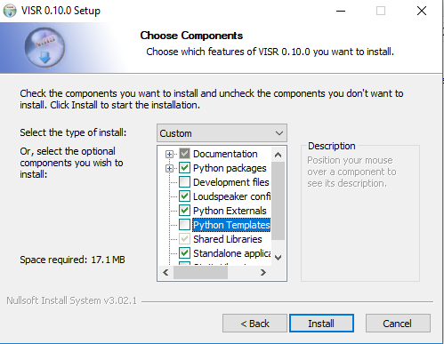
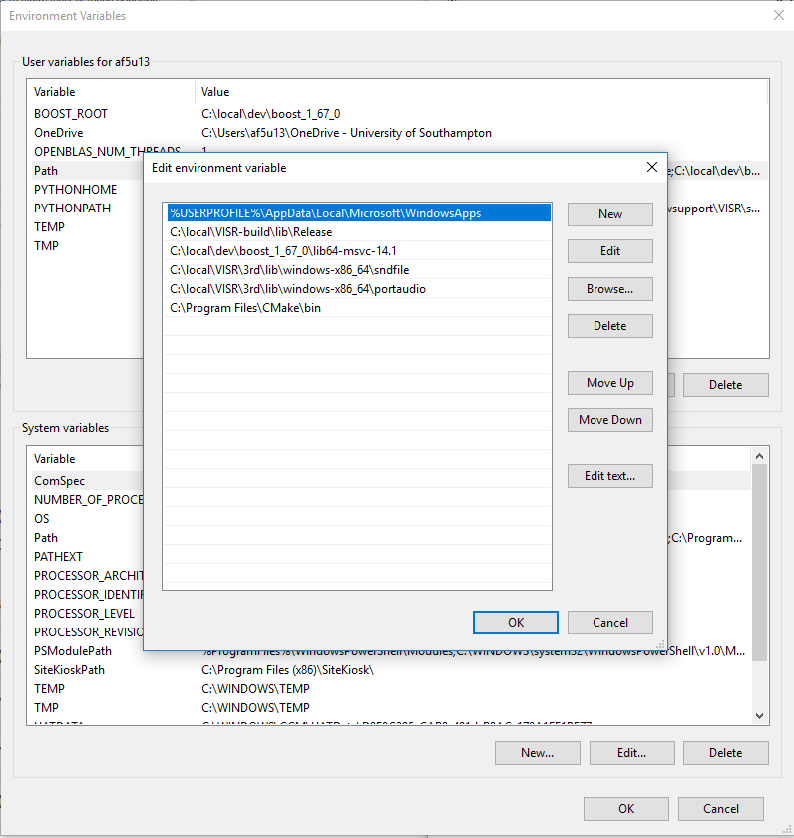
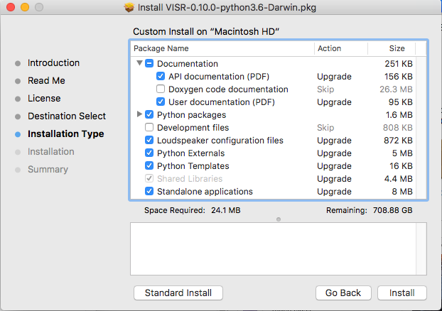
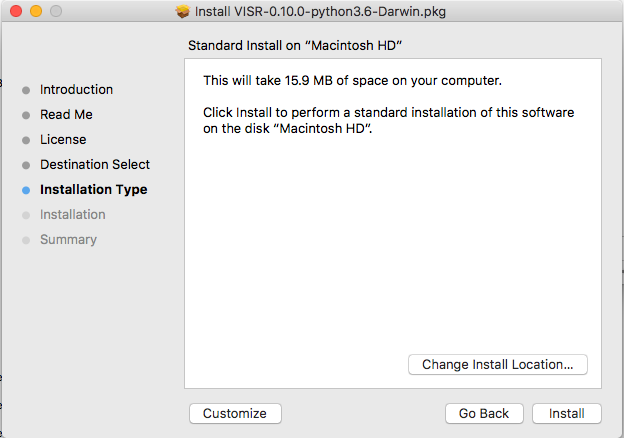

Installing VISR
================================

Binary installation packages are the suggested way to uses the VISR framework.
A binary installers enables all uses of the framework, including

* Running standalone applications
* Using DAW plugins based on the VISR 
* Using the Python interfaces and creating new functionality in Python
* Creating standalone applications and extension libraries in C++

.. hint:: Building the VISR from source is necessary only in these cases:

    - Porting it to a platform where no binary installer exists
    - Fixing or changing the internal workings of the framework.

Installation packages are available on the `S3A Software download page <http://s3a-audio.space>`_.

.. note:: If you plan to use the Python integration of the VISR framework (see :ref:`overview_python_integration`), you need to select an installation package matching the Python version you are using, for example :code:`VISR-X.X.X-python36-Windows.exe`.

.. _installation_windows:

Windows
-------

The graphical installer is provides as an :code:`.exe` file and provides a dialog-based, component-enables installation.
Figure figure_windows_installer_ shows the component selection dialog of the installer. The choices are detailed below in section :ref:`installation_component_description`.

.. _figure_windows_installer:

   
   Graphical Windows installer.

An executable installer (.exe) with a graphical user interface and corresponding uninstall functionality. Supported are 64-bit versions of Windows.
If required, install the "Microsoft Visual C++ Redistributable for Visual Studio 2017", package,
for example from the `Visual C++ downloads page <https://support.microsoft.com/en-us/help/2977003/the-latest-supported-visual-c-downloads>`_.

On Windows, it is necessary to add the directory containing the VISR libraries (DLLs) as well as the directory containing third-party libraries shipped with the VISR installer to the :code:`PATH` variable.
To this end, open the environment variable editor (Settings -> System -> Advanced system settings -> Environment variables).
The environment variable on Windows 10 is depicted in figure windows_environment_variables_editor .

.. _windows_environment_variables_editor:

   
   Environment variable editor on Windows 10.

Append the value :code:`C:\Program Files\VISR-X.X.X\lib;C:\Program Files\VISR-X.X.X\3rd` if the standard installation location was used (Note: Replace :code:`X.X.X` with the actual version number of VISR).
Depending on your system permissions and whether you VISR shall be used by all users of the computer, you can either set the :code:`PATH` user variable or the :code:`PATH` system variable.

.. note::
   Any applications used to access VISR (for example command line terminals, Python development environments, or DAWs) must be closed and reopened before the changed paths take effect.

Append the path ''<install-directory>/lib'' to the path variable, where ''install_diectory'' is the directory specified during the installation.
For the default path, the setting would be :code:`c:\Program Files\VISR-N.N.N\lib`, where :code:`N.N.N` is replaced by the actual version number.
If the :code:`PATH` variable is edited as a string, subsequent paths are separated by semicolons.

.. note:: Future versions of the installer might adjust the paths automatically.
   However, as pointed out in
   `NSIS Path manipulation <http://nsis.sourceforge.net/Path_Manipulation>`_,
   this needs an extremely cautious implementation to avoid potential damage to users' systems.
   
To use standalone applications (see section :ref:`using_visr_using_standalone_renderers`), it may be useful to add the :code:`bin/` directory to the user or system path.
For the default installation location, add :code:`c:\Program Files\VISR-N.N.N\bin` to the :code:`%PATH%` environment variable.

Mac OS X
--------
An installer with a graphical user interface guides through the installation process and allows the selection of optional components.
Figure :ref:`figure_visr_macos_installer` shows a screenshot of this installer.
By default, it installs the VISR into the directory :code:`/Applications/VISR-X.X.X/` where :code:`X.X.X` denotes the version number.

.. _figure_visr_macos_installer:

   
   Component-based installer for Mac OS X.

To access the component selection dialog, use the button "Customize" on the "Installation Type" screen (see figure :ref:`figure_visr_macos_installer_customize`)
   
.. _figure_visr_macos_installer_customize:

   
   "Installation type" screen of Mac OS X installer. Use "Customize" to get to the component selection.

   
To use the standalone applications from the command line, the :code:`bin/` subfolder of the installation directory, e.g., :code:`/Applications/VISR-X.X.X/bin`.
This can be done, for example, by adding 

.. code-block:: bash

   export PATH=$PATH:/Applications/VISR-X.X.X/bin

to the file :code:`$HOME/\.bash_profile`.
However, this works only for running standalone applications from a shell (i.e., a terminal window). 
If you need this path also from applications that are not started from a shell, we recommend the solution used in section :ref:`installation_python_setup_configuration`.

   
Linux
-----

For Linux, installation packages are provided as *.deb* (Debian) packages.
At the moment, this package is monolithic, i.e., it contains all components.
They are installed via the command

.. code-block:: bash

   sudo apt install VISR-<version>.deb

If this command reports missing dependencies, these can be installed subsequently with the command 

.. code-block:: bash

   sudo apt install --fix-broken

After that the framework is ready to use.

.. _installation_component_description:

Installation components
=======================

With the dialog-based, component-enabled installers, parts of the framework can be chosen depending on the intended use of the framework.

Shared Libraries
  The core VISR libraries. This component is mandatory and cannot be unselected.
Standalone applications.
  Renderers and small tools to be run as command-line applications.
Python externals
  Python modules that give access to the functionality of the framework from Python.
  Also needed to run applications that use Python internally (e.g., the binaural synthesis toolkit or metadapter-enabled rendering).
Python Packages
  VISR extensions implemented in Python. This group of components requires the component "Python externals".
Development files
  Header files and CMake build support - Needed to extend the VISR with components using C++ or use the framework in external C++ applications.
Loudspeaker configurations
  A set of standard loudspeaker configuration files and additional example files from actual locations.
Python templates
  A set of commented template files for different types of VISR components.
Documentation
  User and code reference documentation as PDF documents.
  The Doxygen code documentation covering the complete source code can be optionally selected. However, the latter documentation is deprecated and will be contained in the code reference documentation in the future.
  
Setting up Python
=================

As explained in section :ref:`overview_python_integration`, the Python integration is an optional, albeit central, part of the VISR framework that enables a number of its functionalities, for example:

* Using the framework interactively from a Python interpreter.
* Using application that use Python internally, for instance the Binaural Synthesis Toolkit or metadata adaptation processes using the metadapter. 
* Creating new signal flows or algorithms in Python.

To use these functionalities, a Python 3 distribution must be installed on the computer, and some configuration steps are required.

Python distribution
-------------------

Depending on the system, we suggest different Python distributions:

Linux
^^^^^

Use the system-provided Python3 installation.

To install, use the package manager of your distribution, e.g.,

.. code-block:: bash

   sudo apt install python3

Windows and Mac OS X
^^^^^^^^^^^^^^^^^^^^
We recommend `Anaconda <https://www.anaconda.com/download/>`_. Please make sure you install the  Python3 / 64-Bit variant. 

.. note:: Some Mac OS variants (for example 10.12) come with a pre-installed Python 3 variant in :code:`/Library/Frameworks/Python.framework`.
   In this case, care must be taken that it does not interferes with the chosen Python distribution. In particular, the :code:`PYTHONHOME` environment variable must be set correctly.

.. _installation_python_setup_configuration:

Configuration
-------------

Two environment variables must be set to ensure the working of the VISR Python subsystem.

* :code:`PYTHONPATH` This variable is used to add the directory containing the VISR python modules to the system path.
  To this end, the :code:`python/` subdirectory of the installation folder must be added to :code:`PYTHONPATH`.
  
  Note that other ways exist to add to the system path, for example 

  .. code-block:: Python

     import sys
     sys.path.append( '<visr_installation_dir>/python' )

  However, we recommend setting :code:`PYTHONPATH` and assume this in the examples throughout this document.

PYTHONHOME
  This variable is needed to locate the files and libraries of the Python distribution.
  This is especially important if there are more than one distributions on the system, most often on Mac OS X.
  Strictly speaking, this variable is required only if VISR Python code is executed from a C++ application, for instance some DAW plugins, :code:`python_runner` standalone application (section ??), or the :code:`visr_renderer` with metadata processing enabled. (see section :ref:`using_visr_using_standalone_renderers_visr_renderer`).

  This variable has to be set to the root directory of the Python distribution, i.e., 
  one level of hierarchy above the :code:`bin/` folder conatining the Python interpreter.
  Depending on the platform and the distribution, the correct value might be:
  
  Windows with Anaconda
    :code:`C:\ProgramData\Anaconda3`
  Mac OS X with Anaconda
    `$HOME/anaconda3/`
  Linux
    :code:`/usr`

  It is necessary to check whether these settings match with your directory layout.
  
  If the Python distribution provides a :code:`python-config` or :code:`python3-config` binary, the command

  .. code-block:: bash

    python-config --prefix

  or

  .. code-block:: bash

    python3-config --prefix
  
  can be used to retrieve the required value for :code:`PYTHONHOME`
  On Linux, setting :code:`PYTHONHOME` is not necessary in most cases, because there is only the system-provided Python installation available.
  
OPENBLAS_NUM_THREADS 
  It is advisable, in many cases, to set the value of this environment variable to 1. It controls how :code:`numpy` numerical algebra functions are distributed to multiple CPU cores.
  :code:`numpy` is used by the VISR Python integration as well as in many Python-based VISR components performing mathematical or DSP operations. 
  For the matrix/vector sizes typically encountered in our code, the overhead for distributing the work over multiple cores typically exceeds the potential gains.
  Multithreading is disabled by setting the maximum number of cores (or threads) to 1:

  .. code-block:: bash

    OPENBLAS_NUM_THREADS = 1

  This setting is optional. However, if you encounter excessive processor loads, for example a constant 100% load in the real-time thread, this setting can help to resolve the problem.

Depending on the operating system, these variables can be set as follows:

Linux
  Append the lines
  
  .. code-block:: bash

    export PYTHONPATH=$PYTHONPATH:/usr/share/visr/python
    export OPENBLAS_NUM_THREADS=1

  to :code:`$HOME/.profile`.

Windows
  Add :code:`PYTHONPATH` entries either as a user or system variable as described in :ref:`installation_windows` section.
  The corrects setting are (assuming the default installation directory and the Anaconda distribution):
  
  .. code-block:: bash

    PYTHONPATH=c:\Program Files\VISR-X.X.X\python
    PYTHONHOME=c:\ProgramData\Anaconda3
    OPENBLAS_NUM_THREADS=1
  
  Note that if there is already a :code:`PYTHONPATH` variable, the recommended value should be appended, using a semicolon as a separator.

Mac OS X
  In order to set the environment variables system-wide, without requiring that the applications in question is started from a shell, (e.g., a command-line terminal), we recommend a custom :code:`launchd` property list file, as detailed, e.g., in this `StackExchange thread <https://apple.stackexchange.com/questions/106355/setting-the-system-wide-path-environment-variable-in-mavericks>`_.

.. note:: For convenience, the installers create a pre-configured :code:`VISR-X.X.X.plist` file in the :code:`etc` subdirectory of the installation directory (e.g., :code:`/Applications/VISR-X.X.X/etc/VISR-X.X.X.plist` ).
  This file can be either loaded directly or copied to the :code:`LaunchAgents/` directory first. Please check the values in this file first and adjust them accordingly.

  The :code:`VISR-X.X.X.plist` will have this contents:

  .. code-block:: xml

     <?xml version="1.0" encoding="UTF-8"?>
     <!DOCTYPE plist PUBLIC "-//Apple//DTD PLIST 1.0//EN" "http://www.apple.com/DTDs/PropertyList-1.0.dtd">
     <plist version="1.0">
     <dict>
      <key>Label</key>
      <string>my.startup</string>
      <key>ProgramArguments</key>
      <array>
        <string>sh</string>
        <string>-c</string>
        <string>
        launchctl setenv PYTHONPATH /Applications/VISR-X.X.X/python
        launchctl setenv OPENBLAS_NUM_THREADS 1
        launchctl setenv PYTHONHOME <BASE_DIRECTORY_OF_PYTHON_INSTALLATION>
        </string>
      </array>
      <key>RunAtLoad</key>
      <true/>
     </dict>
     </plist>

  By convention, these files are stored in :code:`/Users/<loginname>/Library/LaunchAgents/`.
  To activate the settings, call
  
  .. code-block:: bash
  
    launchctl load <path-to-file>/VISR-X.X.X.plist
    
  To take effect, all applications using these settings (e.g., terminals, Python interpreters, DAWs) must be quit and reopened.
  
  These settings are preserved if the machine is restarted.
  To deactivate them, the property list file must be unloaded:
  
    .. code-block:: bash

      launchctl unload <path-to-file>/VISR-X.X.X.plist

  If you made changes to the settings, you have to perform the :code:`unload` command followed by a :code:`load`.
  
Verifying the installation
==========================

We suggest some basic tests to verify that the VISR framework has been correctly installed and configured.

Testing a standalone application
--------------------------------
This test is to ensure that that the installation is successful, and that the VISR shared libraries can be located and are compatible with the system.
When using the component-enabled installers, the component ``Standalone applications`` must have been selected in order to perform this check.

In a terminal (Linux shell, Mac OS Terminal application, Windows command line :code:`cmd`),
execute this command:

.. code-block:: bash

   <visr-installation-dir>/bin/matrix_convolver --version
   
For the different platforms, the full commands are (assuming the default installation directory)
Windows

  .. code-block:: bash

     "c:\Program Files\VISR-X.X.X\bin\matrix_convolver.exe" --version
     
   Note that the quotes are necessary to cope with the space in the path.
   
Mac OS X

  .. code-block:: bash

     /Applications/VISR-X.X.X/bin/matrix_convolver --version

Linux

  .. code-block:: bash

     /usr/bin/matrix_convolver --version

If you added the :code:`bin/` directory as described above, calling 

  .. code-block:: bash

     matrix_convolver --version
     
is sufficient.

In any case, the call should generate a statement like

  .. code-block:: bash

     VISR Matrix convolver utility  0.10.0

If there is an error message about a missing shared library (or DLL), you should consult the respective section about installation. 
In particular this applies Windows, where the :code:`PATH` variable needs to be set accordingly.

Testing the interactive Python integration
^^^^^^^^^^^^^^^^^^^^^^^^^^^^^^^^^^^^^^^^^^

This test ensures that the VISR framework can be used interactively from Python interpreters.

First start a Python 3 interpreter (for example :code:`python` or :code:`ipython`).
Depending on the system, the binaries might be called :code:`python3` or :code:`ipython3`, respectively
It must be the interpreter of the Python distribution you intend to use (e.g., Anaconda).

In the interpreter, try to import the :code:`visr` modules
  
  .. code-block:: python
    
     import visr

This command should return without an error message.
In this case, you can check whether the module is loaded from the correct location:

  .. code-block:: python

    getattr( visr, '__file__' )

The directory of the resulting file path should be :code:`<visr-installation-dir>/python`.
For example, on Windows this returns :code:`C:\Program Files\VISR 0.10.0\\python\\visr.pyd`.

.. todo:: Add a test with the :code:`python_runner` application to check whether the
   linked Python library is found and the setting of :code:`PYTHONHOME` is sensible.

