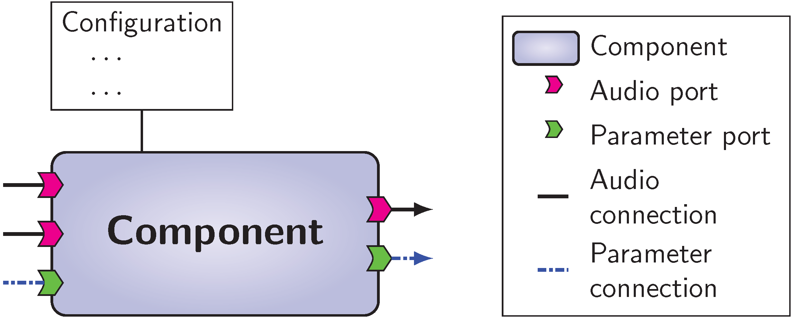
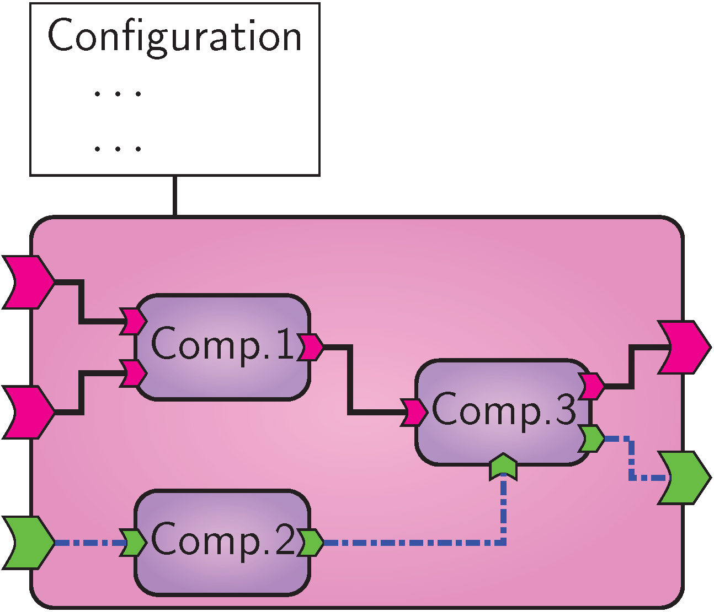
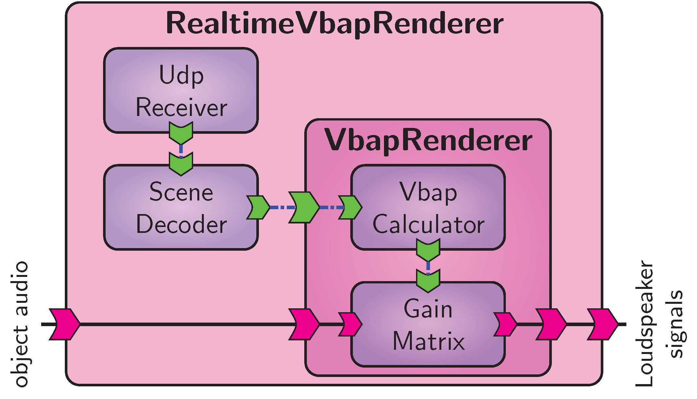
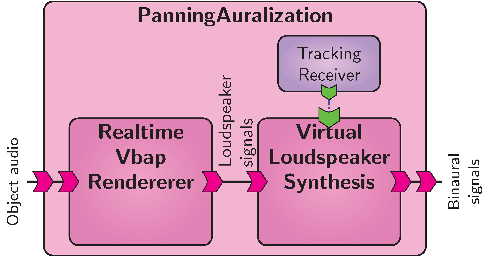
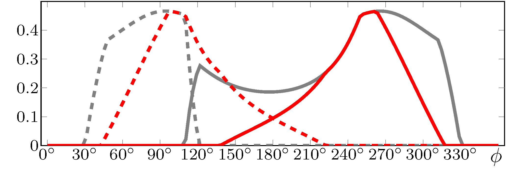
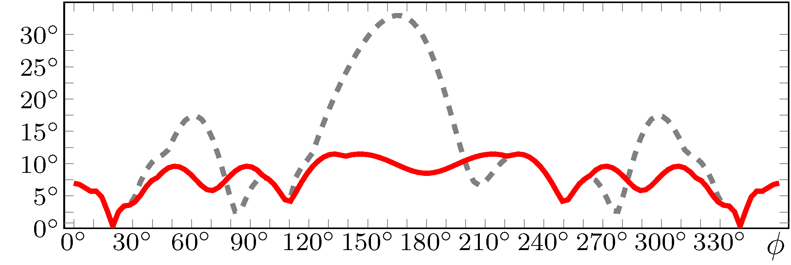
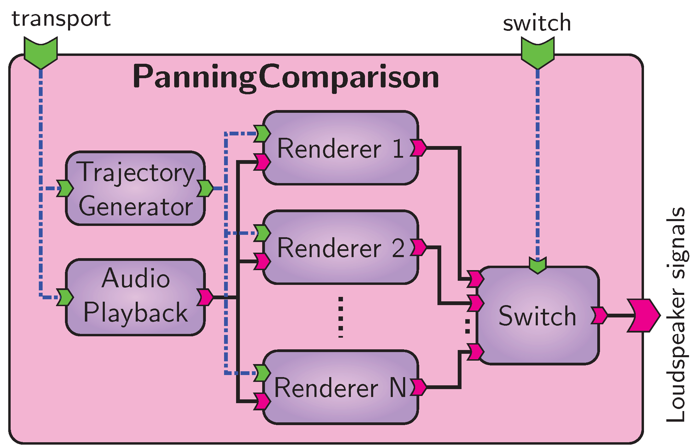
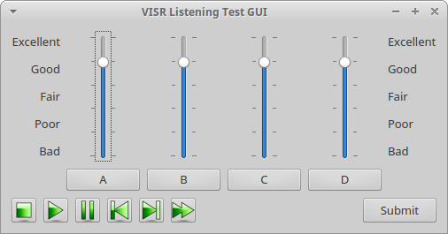
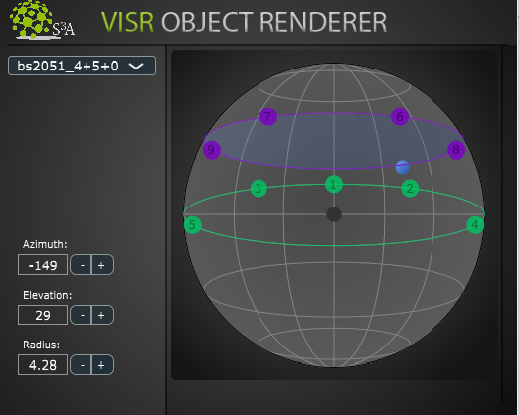

.. _visr_python_tutorial:

VISR tutorial using Python
==========================

.. toctree::

.. note:: This tutorial is an extended version of the paper: Andreas Franck and Filippo Maria Fazi. VISR – a versatile open software framework for audio signal processing. In Proc. Audio Eng. Soc. 2018 Int. Conf. Spatial Reproduction. Tokyo, Japan, August 2018. http://www.aes.org/e-lib/browse.cfm?elib=19628

Software plays an increasingly important role in spatial and object-based audio. 
Realtime and interactive rendering is often needed to subjectively evaluate and demonstrate algorithms, requiring significant implementation effort and often impeding the reproducibility of scientific research.
In this paper we present the VISR (Versatile Interactive Scene Renderer) -- a modular, open-source software framework for audio processing.
VISR enables systematic reuse of DSP functionality, rapid prototyping in C++ or Python, and integration into the typical workflow of audio research and development from initial implementation and offline objective evaluation to subjective testing.
This paper provides a practical, example-based introduction to the VISR framework.
This is demonstrated with an interconnected example, from algorithm design and implementation, dynamic binaural auralization, to a subjective test.

.. _visr_tutorial_sec_introduction:

Introduction
------------

Many areas of audio research depend heavily on software for audio processing and rendering.
This includes not only research on sound reproduction, but also basic and applied research that use audio reproduction as a tool. 
Very often, this rendering must be responsive and interactive, requiring realtime-capable software tools.
Combined with the number of DSP building blocks required for most rendering approaches, this entails a significant implementation effort for many audio research tasks.
At the same time, the increasing importance of reproducible research imposes more demanding requirements on software in order to enable others to reproduce and evaluate your results or to use them in their work :cite:`tut-wilson_et_al2014_best_practices_for_scientific_computing,tut-cannam_figueira_plumbley2012_sound_software_towards_software_research_in_audio_and_music_research`.
Software reuse is a central aspect to tackle these challenges.

Therefore we introduce the VISR (Versatile Interactive Scene Renderer), a novel portable, modular, and open-source software framework for audio processing and reproduction. 
Created in the S3A project (http://www.s3a-spatialaudio.org), e.g., :cite:`tut-coleman_et_al2018_an_audio-visual_system_for_object_based_audio`, with focus on multichannel spatial and object-based audio, it is nonetheless a generic, application-agnostic framework.
It consists of a set of pre-configured rendering signal flow, a library of DSP and audio processing building blocks, and supporting software to run these components in both realtime and offline environments. 
As a software framework, extensibility by users is a central aspect of the VISR.
This can be done by arranging existing building blocks in new ways, incorporating new atomic functionality, or combinations thereof.

There are many existing software projects for audio processing, from DSP and sound synthesis languages as Faust :cite:`tut-orlarey_fober_letz2004_syntactical_and_semantic_aspects_of_faust`, CSound :cite:`tut-boulanger2000_the_csound_book`, and SuperCollider :cite:`tut-wilson_cottle_collins2011_the_supercollider_book`; libraries of spatial processing components as IRCAM's Spat :cite:`tut-carpentier_noisternig_warusfel2015_twenty_years_of_ircam_spat_looking_back_looking_forward`;  frameworks as CLAM :cite:`tut-amatriain_arumi_garcia2008_a_platform_for_efficient_and_rapid_development_of_cross_platform_audio_applications`; Matlab software as the Audio System Toolbox; or rendering applications as the SoundScape Renderer :cite:`tut-geier_hohn_spors2012_an_open-source_c++_framework_for_multithreaded_realtime_multichannel_applications`.

Compared to these projects, we believe that the main advantages of VISR emerge as a combination of the following features:
Firstly, its relatively high level of abstraction based on a component-based, object-oriented architecture enables the creation of complex audio processing schemes with relative ease.
Secondly, the VISR is open-source and highly portable, supporting Windows, Mac OS X, and Linux including single-board computers as the Raspberry Pi, as well as integration into software environments as digital audio workstations (DAWs) or Max/MSP.
Thirdly, the use of Python as an additional implementation language significantly improves the productivity of using the framework and makes it more approachable to users that are not expert programmers.
Finally, and closely related to the Python integration, the VISR framework allows a seamless integration of audio algorithm development with interactive realtime rendering and subjective evaluation.

.. _visr_tutorial_sec_visr_framework:

The VISR Framework
------------------
This section explains the main concepts and entities in the VISR framework.

Component-Based Design
^^^^^^^^^^^^^^^^^^^^^^

.. _figure_visr_tutorial_visr_component_schematic:

   
   General interface of a VISR component.

VISR is a software framework, which means that it enables a systematic reuse of functionalities and is designed for extension by users.
To this, all processing tasks are implemented within *components*, software entities that communicate with other components and the external environment through a defined, common interface.
Figure :ref:`figure_visr_tutorial_visr_component_schematic` depicts the general structure of a component.
Configuration parameters are passed to the component's constructor to customize its behavior.
The external interface of components is defined by ports, which can be connected to other components or may represent external communication.

.. _visr_tutorial_subsec_visr_framework_ports:

Audio and Parameter Ports
^^^^^^^^^^^^^^^^^^^^^^^^^
*Ports* represent data inputs and outputs of a component.
They enable a configurable, directional flow of information between components or with the outside environment. 
There are two distinct types of ports: audio and parameter ports.
Audio ports receive or create multichannel audio signals with an arbitrary, configurable number of channels (single audio signal waveforms), which is referred as the *width* of the port.
Audio ports are configured with a unique name, a width and a sample type such as :code:`float` or :code:`int16`.

Parameter ports, on the other hand, convey control and parameter information between components or from and to the external environment.
Parameter data is significantly more diverse than audio data.
For example, parameter data used in the BST includes vectors of gain or delay values, FIR or IIR filter coefficients, audio object metadata, and structures to represent the listener's orientation.
In addition to the data type, there are also different communication semantics for parameters.
For example, data can change in each iteration of the audio processing, be updated only sporadically, or communicated through messages queues.
In VISR, these semantics are termed *communication protocols* and form an additional property of a parameter port.
The semantics described above are implemented by the communication protocols :code:`SharedData`, :code:`DoubleBuffering`, and :code:`MessageQueue`, respectively.

Several parameter types feature additional configuration data, such as the dimensions of a matrix parameter.
In the VISR framework, such options are passed in :code:`ParameterConfig` objects.
This allows extensive type checking, for instance to ensure that only matrix parameters of matching dimensions are connected.
Combining these features, a parameter port is described by these properties: a unique name, a parameter type, a communication protocol type and an optional parameter configuration object.

.. _visr_tutorial_subsec_visr_framework_atomic_components:

Atomic Components
^^^^^^^^^^^^^^^^^

.. _figure_visr_tutorial_visr_atomic_component:

.. figure:: ../images/visr_python_tutorial/visr_atomic_component.png
   :width: 60 %
   :align: center   
   
   VISR atomic component.

To create and reuse more complex functionality out of existing building blocks, VISR signal flows can be structured hierarchically.
To this end, there are two different kinds of components in VISR, *atomic* and *composite*.
They have the same external interface, that means that they can be used in the same way.
Fig. :ref:`figure_visr_tutorial_visr_atomic_component` schematically depicts these two types.
*Atomic components* implement processing task in program code, e.g., in C++ or Python.
They feature a constructor which may take a variety of configuration options to tailor the behaviour of the component and to initialize its state.
The operation of an atomic component is implemented in the :code:`process()` method.
It typically involves accessing audio input data, performing DSP operations on it and writing it to audio outputs, or receiving, manipulating, and creating parameter data.
Examples how atomic components are implemented are given in Section :ref:`visr_tutorial_subsec_example_prototyping_algorithms`.

.. _visr_tutorial_subsec_visr_framework_composite_components:

Composite Components
^^^^^^^^^^^^^^^^^^^^

.. _figure_visr_tutorial_visr_composite_component:

   
   VISR composite component.

In contrast, a *composite component* contains a set of interconnected components (atomic or composite) to define its behavior.
This is depicted in Figure :ref:`figure_visr_tutorial_visr_composite_component`.
This allows the specification of more complex signal flows in terms of existing functionality, but also the reuse of such complex signal flows.
As their atomic counterparts, they may take a rich set of constructor options.
These can control which contained components are constructed, how they are configured, and how they are connected.
It is worth noting that nested components do not impair computational efficiency because the hierarchy is flattened at initialization time and therefore not visible to the runtime engine.

Using hierarchy to structure signal flows is a powerful and central technique in the VISR framework.
As explained in more detail later, its uses include the reuse of processing functionality and enabling the use of components in different software environments.

.. _visr_tutorial_subsec_visr_framework_rcl:

Standard Component Library
^^^^^^^^^^^^^^^^^^^^^^^^^^
The runtime component library (:code:`rcl`) of the VISR framework contains a number of
components for general-purpose DSP and object-based audio operations.
They are typically implemented in C++ and therefore relatively efficient.
The :code:`rcl` library includes arithmetic operations on multichannel signals, gain vectors and matrices, delay lines, FIR and IIR filtering blocks, but also network senders and receivers and components for decoding and handling of object audio metadata.

.. _visr_tutorial_subsec_visr_framework_runtime_engine:

Runtime Engine
^^^^^^^^^^^^^^
A key objective of the VISR framework is to enable users to focus on their processing task -- performed in a component -- while automating tedious tasks, such as error checking, communication between components, or interfacing audio hardware, as far as possible.
The rendering runtime library (:code:`rrl`) serves this purpose.
Starting from a top-level component, it is only necessary to construct an object of type :code:`AudioSignalFlow` for this component.
All operations from consistency checking to the initialization of memory buffers and data structures for rendering is performed by this object.
The :code:`audiointerfaces` library provides abstractions for different audio interface APIs (such as Jack, PortAudio, or ASIO).
Realtime rendering is started by connecting the :code:`SignalFlow` object to an 
:code:`audiointerfaces` object.

.. _visr_tutorial_subsec_visr_framework_python_interface:

Python interface
^^^^^^^^^^^^^^^^
While the core of the VISR framework is implemented in C++, it provides a full application programming interface (API) for the Python programming language.
This is to enable users to adapt or extend signal flows more productively, using an interpreted language with a more accessible, readable syntax and enabling the use of rich libraries for numeric computing and DSP, such as NumPy and SciPy :cite:`tut-oliphant2007_python_for_scientific_computing`.
The Python API can be used in three principal ways:

Configuring and running signal flows
~~~~~~~~~~~~~~~~~~~~~~~~~~~~~~~~~~~~
Components can be created and configured from the interactive Python interpreters or script files.
This makes this task fully programmable and removes the need for external scripts to configure renders.
In the same way, audio interfaces can be configured, instantiated and started from within Python, enabling realtime rendering from within an interactive interpreter.

Extending and creating signal flow
~~~~~~~~~~~~~~~~~~~~~~~~~~~~~~~~~~
As described above, complex signal flows are typically created as composite components.
This can be done in Python by deriving a class from the base class :code:`visr.CompositeComponent`.
The behavior of the signal flow is defined in the class' constructor by creating external ports, contained components, and their interconnections.
Instances of this class can be used for realtime rendering from the Python interpreter, as described above, or from a standalone application. 

Adding atomic functionality
~~~~~~~~~~~~~~~~~~~~~~~~~~~
In the same way as composites, atomic components can be implemented by deriving from :code:`visr.AtomicComponent`.
This involves implementing the constructor set up the component and the :code:`process()` method that performs the run-time processing.
The resulting objects can be embedded in either Python or C++ composite components (via a helper class :code:`PythonWrapper`).

.. _visr_tutorial_subsec_visr_framework_offline_rendering:

Offline Rendering
~~~~~~~~~~~~~~~~~
By virtue of the Python integration, signal flows implemented as components are not limited to realtime rendering, but can also be executed in an offline programming environment.
Because the top-level audio and parameter ports of a component can be accessed externally, dynamic rendering features such as moving objects or head movements can be simulated in a deterministic way.
In the majority of uses, this is most conveniently performed in an interactive Python environment.
Applications of this feature range from regression tests of atomic components or complex composite signal flows, performance simulations, to offline rendering of complete sound scenes.

.. _visr_tutorial_subsec_visr_framework_use_multiple_enironments:

Use in multiple software environments
~~~~~~~~~~~~~~~~~~~~~~~~~~~~~~~~~~~~~
The VISR framework aims to ease the reuse of audio processing functionality in different software environments, for instance as plugins for digital audio workstations (DAWs) or as blocks in visual programming languages as Max/MSP.
The main goal is to make the functionality available to a larger group of users, enable them to integrate them into their workflow, and to use it as building blocks for their applications.
Moreover, providing software components that are integrated into a host environment often reduces the complexity of a audio processing system, as opposed to a standalone renderer that requires a separate binary, dedicated connections, and possibly an additional computer.

Such an integration is enabled both by architectural features of the framework and support libraries that are part of VISR.
Firstly, the modular design, in particular the component abstraction which is independent of a specific audio API or a specific model of execution, enables running VISR components within a multitude of software environments.
Secondly, the extensible parameter subsystem that makes control data input and output accessible from outside the components eases a translation to the host-specific communication mechanism.
Finally, VISR contains a set of support libraries that simplifies the translation between the VISR interfaces and the API of the host environment and reduces the necessary amount of code for wrapping a VISR component in, e.g, a VST plugin or a Max/MSP external.

.. _visr_tutorial_sec_application_example:

Application Example: Panning Algorithm Development
--------------------------------------------------

In this section we explain the use of the VISR framework in a continued application example.
To this end we describe the prototyping and testing of a multichannel amplitude panning technique.
For expressiveness and conciseness, the examples are presented in the Python language.
However, the same functionality could also be achieved in C++ at the expense of an increased code size and a steeper learning curve.
This tutorial example displays only relevant code sections, sometimes in abridged form.
The full source code is available through :cite:`tut-s3a2018_visr_download_site`.

Obtaining and installing the VISR framework
^^^^^^^^^^^^^^^^^^^^^^^^^^^^^^^^^^^^^^^^^^^

The VISR framework is available under a permissive open-source license which allows for free use and modification.
Installation packages and setup instructions are provided in section :ref:`getting_visr`.
To use the Python integration, Python 3 must be installed.
For Windows ans Mac OS we recommend the Anaconda distribution (https://anaconda.org/).
Note that the installer must match the Python major and minor version number on the target system, e.g., Python 3.5.

Creating and Adapting Signal Flows
^^^^^^^^^^^^^^^^^^^^^^^^^^^^^^^^^^

.. _figure_visr_python_tutorial_vbap_panner:

   
   Basic amplitude panning system for real-time rendering.

The most basic way to create and adapt audio processing functionality in the VISR framework is to parameterize and connect existing building blocks.
To this end we create a new :code:`CompositeComponent`.
We demonstrate that by building a simple multichannel amplitude panning renderer, which is schematically depicted in Figure :ref:`figure_visr_python_tutorial_vbap_panner`.
The corresponding source file is :code:`vbap_renderer.py`.

.. code-block:: python
		
   import visr, pml, rcl	
   class VbapRenderer( visr.CompositeComponent ):

This starts by importing several Python modules that provide VISR functionality, namely :code:`visr` for the core API, :code:`rcl` for the built-in component library (see Section :ref:`visr_tutorial_subsec_visr_framework_rcl`) and the :code:`pml` for parameter data and communication protocols (Section :ref:`visr_tutorial_subsec_visr_framework_ports`).
The signal flow class :code:`VbapRenderer` is derived from the VISR base class :code:`visr.CompositeComponent`. 

.. code-block:: python
		
   def __init__( context, name, parent, 
                 numObjects, lspConfig ):
     super().__init__( context, name, parent )    

As explained in Section :ref:`visr_tutorial_subsec_visr_framework_composite_components`, the functionality of a composite component is embodied in its constructor, which defines external inputs and outputs, the contained components, and their connections.
Here, the constructor takes the standard parameters :code:`context` to specify audio block size and sampling rate, :code:`name` to assign a unique name, and :code:`parent` for an optional parent component (:code:`None` denotes a top-level flow).
The class-specific parameters :code:`numObjects` and :code:`lspConfig` customize instances of this specific class.
The call :code:`super().__init__(...)` initializes the base class object..

.. code-block:: python
		
    self.audioIn = visr.AudioInputFloat( "in",
      self, numObjects )
    self.audioOut = visr.AudioOutputFloat( "out",
      self, numLsp )
    self.objectIn = visr.ParameterInput("objects",self,
        pml.ObjectVector.staticType,
        pml.DoubleBufferingProtocol.staticType,
        pml.EmptyParameterConfig() )

Here, we define an audio input and an audio output as well as an parameter input to receive object metadata.
The simple panning renderer contains two components, :code:`VbapGainCalculator` and :code:`GainMatrix`. The former calculates a matrix of panning gains from set of object metadata, and the latter applies these gains to a set of object audio signals to form loudspeaker outputs.
These components are instantiated as members variables of the :code:`VbapRenderer` class.

.. code-block:: python
		
   self.calculator = rcl.PanningCalculator( 
     context, "VbapGainCalculator", self,
     numberOfObjects, lspConfig )
   self.matrix = rcl.GainMatrix( context, 
     "GainMatrix", self, numberOfObjects, numLsp
     interpolationSteps=context.period )

Finally, connection between the components' input and output ports as well as external ports are defined by using API methods of :code:`CompositeComponent`.

.. code-block:: python
		
   self.audioConnection( self.audioIn,
     self.matrix.audioPort("in") )
   self.audioConnection(self.matrix.audioPort("out"), 
   self.audioOut)
   self.parameterConnection(self.objectIn,
     self.calculator.parameterPort("objectIn"))
   self.parameterConnection( 
     self.calculator.parameterPort("gainOutput"),
     self.matrix.parameterPort("gainInput" ))

This example shows how complex, multichannel signal flows can be readily created in VISR using high-level building blocks and sophisticated multichannel audio and data connections.

To use the :code:`VbapRenderer` in a realtime setting, we must provide means to receive audio object metadata, e.g., from an audio workstation.
In the VISR framework, this is best done by creating a new top-level composite component, denoted :code:`RealtimeVbapRenderer` in Figure :ref:`figure_visr_python_tutorial_vbap_panner`, that contains the :code:`VbapRenderer` and means to receive and decode object metadata from network messages.
This is done by the components :code:`UdpReceiver` and :code:`SceneDecoder`, both contained in the VISR :code:`rcl` library.
Organizing functionality hierarchically into composite components, including moving supplemental tasks as network communication outside the core algorithm, is recurring design pattern in VISR signal flows.
As demonstrated in later sections, it fosters reuse of functionality and helps to use the same algorithm in different software environments.

.. _visr_tutorial_subsec_example_realtime_and_binaural:

Realtime Execution and Binaural Auralization
^^^^^^^^^^^^^^^^^^^^^^^^^^^^^^^^^^^^^^^^^^^^

Components -- both composite and atomic -- can be readily used for realtime rendering, both as a standalone application or from a Python session.
We first describe the latter, interactive approach.
To run a VISR component, we first construct an object of type :code:`rrl.AudioSignalFlow`.

.. code-block:: python
		
   import rrl
   ...
   flow = rrl.AudioSignalFlow( component )

It contains all information and data structures needed to execute the component's signal flow.
During construction, it flattens hierarchical signal flows and performs consistency checks.

In a second step we create an :code:`AudioInterface` object representing an audio device, e.g., a sound card.

.. code-block:: python
		
   flow = rrl.AudioSignalFlow( renderer )
   aiConfig = ai.AudioInterface.Configuration( 
   aIfc = ai.AudioInterfaceFactory.create("PortAudio",
    numberOfInputs=numObjects, numberOfOutputs=2,
    samplingFrequency=fs, period=bs )
   aIfc.registerCallback( flow )
   aIfc.start()

At the moment the :code:`audiointerfaces` library contains classes for two backends, namely the cross-platform PortAudio library (http://www.portaudio.com/) and the Jack sound server (http://www.jackaudio.org/) (Linux and Mac OS X).
Additional backends can be implemented in the future, which is supported by the :code:`AudioInterfaceFactory` factory interface to instantiate audio interfaces.
This method accepts also an optional :code:`optionalConfig` parameter to pass backend-specific options.

The second way to run a VISR signal flow is to build a standalone application, typically in C++.
This application would create an instance of the VISR component to be executed, and could use the functionality of the :code:`audiointerfaces` and :code:`rrl` libraries to perform the realtime rendering.
For top-level components implemented in Python, a simpler way exists by using the :code:`python_wrapper` application that is included in the VISR distribution.

.. code-block:: bash

   python_runner -m vbap_renderer
    -c RealtimeVbapRenderer -a "2,'../data/stereo.xml'"
    -k "{'nwPort': 4242}" -D PortAudio

Here, :code:`vbap_renderer` is the name of the Python module, :code:`RealtimeVbapRenderer` is the name of class name of a top-level component implemented in this module, :code:`$-$D PortAudio` denotes the audio interface to be used, while :code:`$-$a` and :code:`$-$k` are used to pass positional and keyword arguments to the component's constructor.
For this to work, the main module (:code:`vbap_renderer` in this example) and other used Python modules must be contained in the Python module search path, either by setting the :code:`PYTHONHOME` environment variable or by passing the path via the :code:`$-$d` option.
In this way, the :code:`python_runner` utility app allows for an easy use of VISR signal flows specified in Python without requiring an interactive Python interpreter.

Because multi-loudspeaker panning algorithms require sophisticated setups, they are difficult to auralize.
The VISR framework makes it easy to couple an algorithm with tools for auralization over headphones using dynamic binaural synthesis, e.g., :cite:`tut-mackensen_et_al1999_binaural_room_scanning_a_new_tool_for_acoustic_and_psychoacoustic_research,tut-pike_romanov2017_an_impulse_response_dataset_for_dynamic_data-based_auralization_of_advanced_sound_systems`.
The VISR framework allows for a straightforward integration of such tools.
Here we use the Binaural Synthesis Toolkit :cite:`tut-franck_et_al2018_an_open_realtime_binaural_synthesis_toolkit_for_audio_research`, a set of components for binaural rendering implemented in the VISR framework
The BST implements different approaches to binaural synthesis, namely dynamic HRTF-based rendering, synthesis based on Higher Order Ambisonics, and virtual loudspeaker rendering (or binaural rool scanning).
Here we use the :code:`VirtualLoudspeakerRenderer` component that transforms a set of loudspeaker signals into a binaural signal.

.. _figure_visr_python_tutorial_vbap_panner_auralisation:

   
   Panning algorithm auralization.
   
To this end, we create a new top-level component depicted in Figure :ref:`figure_visr_python_tutorial_vbap_panner_auralisation`.
It is composed of the :code:`RealtimeVbapRenderer` component whose loudspeaker signal output is connected to the :code:`VirtualLoudspeakerRenderer` instance. 
The latter can also receive listener tracking information to incorporate the listener's head orientation.
In this case, a :code:`TrackingReceiver` component specific to the tracking system used is instantiated and connected to the binaural module.

It is noted that the two parts could also be instantiated as separate realtime applications, and connected using a sound server as Jack.
VISR's ability to combine the components, however, makes such applications less dependent on the capabilities of the operating system and reduces the effort to control such complex configurations.

.. _visr_tutorial_subsec_example_prototyping_algorithms:
   
Prototyping Atomic functionality
^^^^^^^^^^^^^^^^^^^^^^^^^^^^^^^^
In addition to creating new functionality by interconnecting existing components, the VISR framework can be extended by implementing new primitive (or atomic) functionality as C++ or Python code.
This is done by creating new atomic components, which can then be used either standalone or combined with other VISR components.
In this section we demonstrate this functionality by prototyping a novel multi-loudspeaker panner -- an algorithm for calculating loudspeaker gains -- as an atomic component in Python.
The novelty of this approach is that it uses a convex optimization algorithm to compute a solution with similar properties to VBAP, but uses :math:`\ell_{2}` optimality to resolve ambiguity issues of VBAP, see :cite:`tut-hughes_et_al2018_dual_frequency_amplitude_panning_for_multichannel_audio_systems`.
Using the VISR framework it is possible to use the rich set of libraries for technical and scientific computing available in Python, in this case the numerical optimization package **cvxpy** :cite:`tut-diamond_boyd2016_cvxpy`, for algorithm prototyping and realtime evaluation.
The source code can be found in :code:`vbap_l2_panner.py`.

An atomic component is implemented as a class derived from :code:`visr.AtomicComponent`

.. code-block:: python
	
   class VbapL2Panner( visr.AtomicComponent ):
     ...

The component has a constructor similar to that of a composite component, taking the mandatory arguments :code:`context`, :code:`name` and :code:`parent` plus a custom set of configuration parameters.

.. code-block:: python

   def __init__( self, context, name, parent,
     numObjects, lspConfig, spread ):
     super().__init( context, name, parent )
     self.objectIn = pml.ParameterInput( "objects", self,
       pml.DoubleBuffering.type, pml.ObjectVector.type,
       pml.EmptyParameterConfig() )
     ...
     self.L = lspConfig
     ...
     self.problem = cvxpy.Problem( self.objective,
                                   self.constraints )
     ...

Like in composite components, the :code:`__init__()` method calls the constructor of the superclass and creates audio and parameter ports.
In addition, it sets up any internal data structures, for instance storing the loudspeaker positions in :code:`self.L` and setting up the optimization problem as :code:`self.problem`.
As described in Section :ref:`visr_tutorial_subsec_visr_framework_atomic_components`, atomic components implement their behavior in the :code:`process()` method.

.. code-block:: python

   def process( self ):
     if self.objectIn.protocol.changed():
       self.objectIn.protocol.resetChanged()
       objVec = self.objectIn.protocol.data()
       gains = np.array( self.gainOut.protocol.data() )
       pointSources = [o for o in objVec
        if isinstance( o, objectmodel.PointSource )]]
       for obj in pointSources:
         self.b.value = obj.position
         self.problem.solve()
         gains[:,obj.id] = normalise( np.squeeze(
           np.asarray(self.g.value) ), norm=2 )
   
Here, the code first gains access to the object vector input and checks if the input has changed.
In this case, both the current object vector and the output gain matrix are obtained, and the computation is performed.
This consists of calling the optimization method for each point source object and assigning the resulting gain vector to the respective row in the panning gain matrix.
The resulting component can be used in the same way as a built-in atomic component. That is, it can be executed as a standalone top-level component or in a composite flow defined in either Python or C++.

As an example for an audio-processing atomic component we show a simplified gain matrix as used in the VBAP renderers.

.. code-block:: python

   class GainMatrix( visr.AtomicComponent ):
     def __init__(self,context,name,parent,nIn,nOut):
      super().__init__( context, name, parent )
      self.audioIn=visr.AudioInputFloat("in",self,nIn)
      self.audioOut=visr.AudioOutputFloat("out",self,nOut)
      self.mtxIn=visr.ParameterInput( "gainInput",
        self, pml.MatrixParameterFloat.staticType,
        pml.SharedDataProtocol.staticType,
        pml.MatrixParameterConfig(nOut, nIn ))
     def process( self ):
      gains  = np.array( self.mtxIn.protocol.data() )
      ins = self.audioIn.data()
      self.audioOut.set( gains <at> ins )
   
It defines an audio input and an audio output with distinct widths and a parameter input to receive the gain coefficients.
The :code:`process()` function accesses the sample data of the audio ports as **NumPy** arrays and uses the matrix multiplication operator :code:`@` to calculate the result.
This shows how numeric and DSP functionality can be prototyped on a high level of abstraction.
But if required, the :code:`AudioPort` interface also enables access to individual audio channels and samples.

Offline Testing and Objective Evaluation
^^^^^^^^^^^^^^^^^^^^^^^^^^^^^^^^^^^^^^^^
As explained in Section :ref:`visr_tutorial_subsec_visr_framework_offline_rendering`, VISR enables the offline execution and analysis of components, both C++ and Python, within an interactive Python environment
This allows for the use of the same source code for algorithm development, offline processing, and realtime rendering.
In this section we show how this feature is used to design and evaluate the panning component created in Section :ref:`visr_tutorial_subsec_example_prototyping_algorithms`.
The source code is contained in the file :code:`simulate_l2_renderer.py`.

The code for the offline simulation is very similar to the realtime case shown in Section :ref:`visr_tutorial_subsec_example_realtime_and_binaural`.
As there, the main tasks consist of configuring and creating the top-level component and the creation of an :code:`AudioSignalFlow` object.
But instead of instantiating and registering to an audio interface, the multichannel audio input is provided as a matrix of samples,
and another matrix is provided for the output signals.

.. code-block:: python

   fs,inSignal=scipy.io.wavfile.read('test.wav').T
   sigLen=inSignal.shape[-1]
   outSignal=np.zeros( (numLsp, sigLen ) )

Parameter data is transferred to and from top-level parameter ports by retrieving their communication protocol endpoints through the AudioSignalFlow object.
In this example, the signal flow has a parameter input named :code:`objects` to receive object metadata.

.. code-block:: python

   objectIn = flowparameterReceivePort('objects')

Data can be sent and received using the semantics of the port's communication protocol.

.. code-block:: python

   numBlocks = sigLen // bs
   for bi in range(0,numBlocks):
     ps = objectmodel.PointSource(0)
     ps.pos = trajectory[bi,:]
     ps.level = 1
     ps.channels = [0]
     objectIn.data().set([ps])
     objectIn.swapBuffers()
     outSignal[:,bi*bs:(bi+1)*bs]
    	= flow.process( inSignal[:,bi*bs:(bi+1)*bs] )

Here, the audio signal is partitioned into a number of blocks.
For each block, a point source object with a new position is created and transmitted to the rendering component using the methods :code:`set()` and :code:`swapBuffers()` of the object vector input port.
Then the signal flow is executed for one block of input data per iteration and the generated audio samples are concatenated into a multichannel output signal.

.. _figure_visr_python_tutorial_offline_simulation_audio_signal:

.. figure:: ../images/visr_python_tutorial/offline_simulation_audio_signal.png
   :width: 80%
   :align: center   
   
   Offline simulation plots of the proposed panning algorithm: Audio signal.

Figure :ref:`figure_visr_python_tutorial_offline_simulation_audio_signal` shows the output signal for one loudspeaker (top-rear right position :code:`U-135`)) of a 9-loudspeaker setup according to ITU-R BS.2051 :cite:`tut-itu2017-itu-r-bs2051-1` and compares it to the output of a standard VBAP implementation.
The sound object is a sinusoidal tone rotating around the central listener at a constant elevation of :math:`10^{\circ}`.
The plot shows that the proposed algorithm yields a more localized, monotonically ancreasing and decreasing signal magnitude as the source psition moves, whereas in the VBAP algorithm the same loudspeaker is activated for a wider range of source position and exhibits a fluctuating magnitude.
Audio signals obtained in this way can be used for playback or used as input for further analysis, e.g., by using binaural localization models.

In addition to analyzing audio signals, it is also possible to analyze smaller building blocks and their input and output parameter data.
Two features of the VISR framework make this possible.
Firstly, all building blocks are components. 
That means that they can be inspected at all levels of the hierarchy, from complex top-level signal flows down to atomic algorithms.
Secondly, by exposing the extensible parameter data subsystem to the Python language, the VISR framework enables the generation of sophisticated control data trajectories and the evaluation of parameter data generated by the signal flow in an interactive programming environment.
Here, we test the :code:`VbapL2Panner` component separately, setting object positions for the same set of azimuths as in the previous example.

.. code-block:: python

   pannerVbapL2 = VbapL2Panner( ctxt, 'renderer',
      None, numObjects, lc )
   flow = rrl.AudioSignalFlow( pannerVbapL2 )
   objectIn = flow.parameterReceivePort('objects')
   gainOut = flow.parameterSendPort('gains')
   gainsVbapL2 = np.zeros( (numLsp,len(az) )
   for bi in range(0,numBlocks):
     ps1 = ojectmodel.PointSource(0)
     ps1.position = sph2cart( az[bi], el, r )
     ps1.channels = [0]; ps1.level=1.0
     objectIn.data().set( [ps1] )
     objectIn.swapBuffers()
     flow.process()
     gainsVbapL2[:,bi] =  np.squeeze(gainOut.data())

The flow object is executed for each setting of the azimuth value. 
Since the :code:`VbapL2Panner` component has no audio ports, the call :code:`flow.process()` does not involve audio signals. 
Instead, the protocol of the parameter output :code:`"gains"` is accessed and the panning gains for all azimuths are collected in a matrix.

.. _figure_visr_python_tutorial_offline_simulation_gains:

   
   Offline simulation plots of the proposed panning algorithm: Panning gains.

Figure :ref:`figure_visr_python_tutorial_offline_simulation_gains` shows the resulting gains of the :code:`VbapL2Panner` and the standard VBAP algorithm for the upper-rear loudspeakers :code:`U-135` and :code:`U+135` as a function of the source's azimuth.
For plain VBAP, the gains for the symmetrical loudspeaker positions are asymmetrical, and :code:`U-135` is active for a wide range of azimuths with some rapid gain changes.
This is in accordance with the audio signal depicted in Figure :ref:`figure_visr_python_tutorial_offline_simulation_audio_signal`, and is caused by ambiguities inherent to the VBAP algorithm, see e.g., :cite:`tut-franck_wang_fazi2017_sparse_l1-optimal_multiloudspeaker_panning_and_its_equivalence_to_vector_based_amplitude_panning`.
In contrast, the proposed algorithm offers symmetric, localized loudspeaker activations that with smoother transitions as the source moves.

.. _figure_visr_python_tutorial_offline_simulation_energy_direction_difference:

   
   Offline simulation plots of the proposed panning algorithm: Energy vector direction difference.

Access to such data also enables more sophisticated analyses.
As an example, Figure :ref:`figure_visr_python_tutorial_offline_simulation_energy_direction_difference` shows the difference of the energy vector, a metric to estimate the localisation of mid-to-high frequency content, for both algorithms. It shows that the error is smaller and more even for the proposed VBAP L2 algorithm than for the standard algorithm. 
This corroborates that the proposed panning scheme overcomes some shortcomings of the plain VBAP algorithm.
This example shows how VISR's offline execution features can ease the development, testing, and evaluation of audio signal processing components, from algorithmic building blocks to complex signal flows.
By using the same implementation as for realtime rendering, this offers the potential of unifying conventional signal processing development and realtime-capable implementation.

Subjective Listening Test Application
^^^^^^^^^^^^^^^^^^^^^^^^^^^^^^^^^^^^^
..
   \begin{figure}
     \centering
     \subfloat[VISR signal flow]
     {
       \TikZGraphics{0.8\columnwidth}{!}{figures/panning_comparison}
       \label{fig:panning_comparison_signal_flow}
     } \\
     \subfloat[Python user interface]
     {
	   \includegraphics[width=0.75\columnwidth]{figures/listening_test_gui}
       \label{fig:panning_comparison_ui}
     }
     \caption{Subjective listening test application.}
     \label{fig:panning_comparison}
   \end{figure}

.. _figure_visr_python_tutorial_panning_comparison:

   
   Subjective listening test application: VISR signal flow.

   
In this section we demonstrate how audio processing algorithms implemented as VISR components can be readily integrated into larger, interactive applications and graphical user interfaces.
To this end we create a listening test tool, which allows for a subjective evaluation of the proposed panning algorithm and comparison to existing approaches by presenting multiple stimuli as standardised, e.g., in ITU-R BS.1534 :cite:`tut-itu2017-itu-r-bs2051-1`.

With the VISR framework, the signal processing is implemented as a new top-level composite component, shown in Figure :ref:`figure_visr_python_tutorial_panning_comparison`, which contains the proposed renderer as one component, alongside renderers for other rendering schemes.
The top-level component provides audio and object metadata to all candidate algorithms, and facilitates an multichannel selector for glitch-free switching between the methods.

.. _figure_visr_python_tutorial_listening_test_gui:

   
   Subjective listening test application: Python user interface.

In this example the graphical user interface, shown in Figure :ref:`figure_visr_python_tutorial_listening_test_gui`, is implemented in Python (using the PyQt library), and the rendering is embedded into this application within a :code:`rrl.AudioSignalFlow` instance.
The flexible parameter subsystem allows for an interactive control of the media playback and the rendering method selection.
To this end, control data is sent directly from the UI code to the parameter ports :code:`transport` and :code:`switch`.
This example shows how the use of the VISR framework can reduce the time and effort needed to perform a subjective evaluation of audio processing algorithms.

Use in Different Software Environments
^^^^^^^^^^^^^^^^^^^^^^^^^^^^^^^^^^^^^^
As explained in Section :ref:`visr_tutorial_subsec_visr_framework_use_multiple_enironments`, the VISR framework enables the use of audio processing components by embedding them into other audio software environments.

.. _figure_visr_python_tutorial_max_msp_example:

.. figure:: ../images/visr_python_tutorial/max_msp_example.png
   :width: 60%
   :align: center   
   
   Interactive loudspeaker rendering binauralization implemented in Max/MSP using VISR components as externals.

Figure :ref:`figure_visr_python_tutorial_max_msp_example` shows an example of an interactive multichannel loudspeaker rendering combined with a binaural auralization, both implemented as Max/MSP externals.
The input to the :code:`visr_renderer~` external is provided by a Max Patch that creates audio object metadata, which are transmitted to the renderer as string messages.
The loudspeaker outputs are connected to the :code:`virt_lsp_binaural~` binauralization algorithm, which receives head orientation data from a tracking device through a serial port.
This example shows how VISR components can be integrated into interactive, possibly audio-visual applications.

.. _figure_visr_python_tutorial_object_renderer_plugin_vst:

   
   DAW plugin for object-based rendering using VISR components.

The second example, depicted in Figure :ref:`figure_visr_python_tutorial_object_renderer_plugin_vst`, shows a DAW plugin, that renders a point source object to a multi-loudspeaker setup.
The rendering is performed by a VISR component within the plugin.
VISR's flexible control parameter subsystem allows for controlling object parameters as the point source position and to connect them to automation parameters of the DAW.

.. _visr_code_turial_sec_conclusion:

Conclusion and Outlook
----------------------

In this paper we introduced the VISR framework, an open-source portable and general-purpose framework for audio processing that is well-suited for multichannel, object-based, and spatial audio.
Based on a continued application example of a multi-loudspeaker panning algorithm, we showed how the elements of the framework can be used to create and modify complex audio signal flows.
Moreover, we explained how the extensibility features of the VISR, in particular the Python language interface, can be used to design, prototype, and evaluate novel audio processing algorithms, demonstrating how this can streamline a typical workflow in audio research and development.
Finally, we demonstrated how audio processing functionality implemented in the VISR framework can be embedded in other software environments, for example Max/MSP or plugins for digital audio workstations.

Future developments will focus on the following aspects:
Firstly, adding support for additional hardware platforms, operating system versions, and audio APIs, and improved multiprocessor support.
Secondly, providing code libraries to ease the embedding of VISR components into software environments as Max/MSP, PureData or DAW plugin SDKs.
Thirdly, to create libraries of building blocks and ready-made renderers for different application areas of audio processing.

We provide the VISR framework as an open-software framework to foster reproducible research in audio signal processing.

References
----------

.. bibliography:: references_visr_introduction.bib
   :labelprefix: T
   :style: unsrt
   :filter: docname in docnames	  
